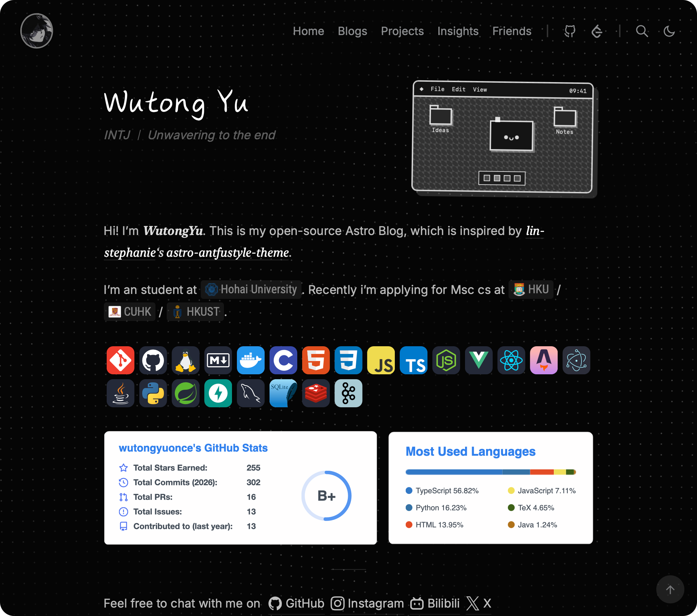
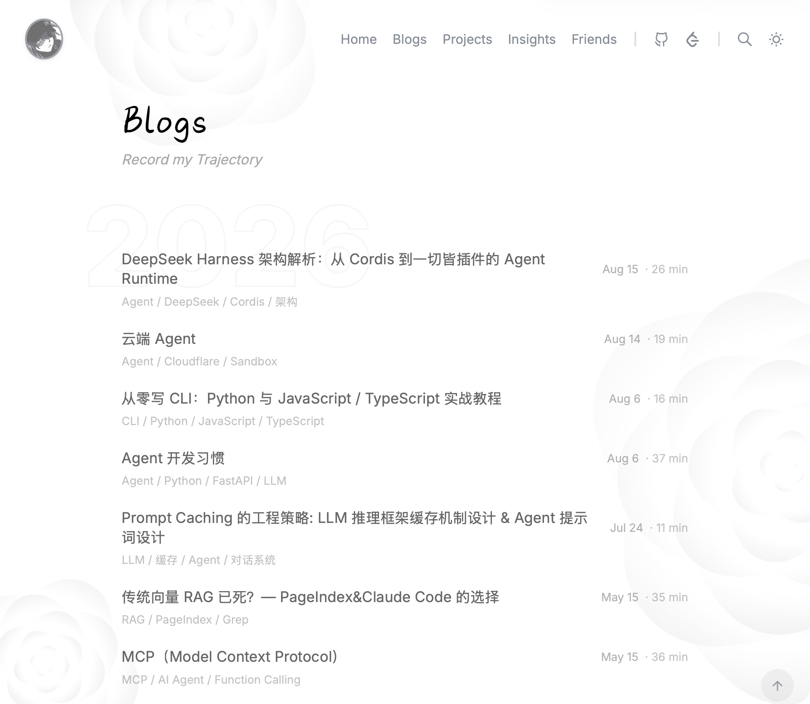
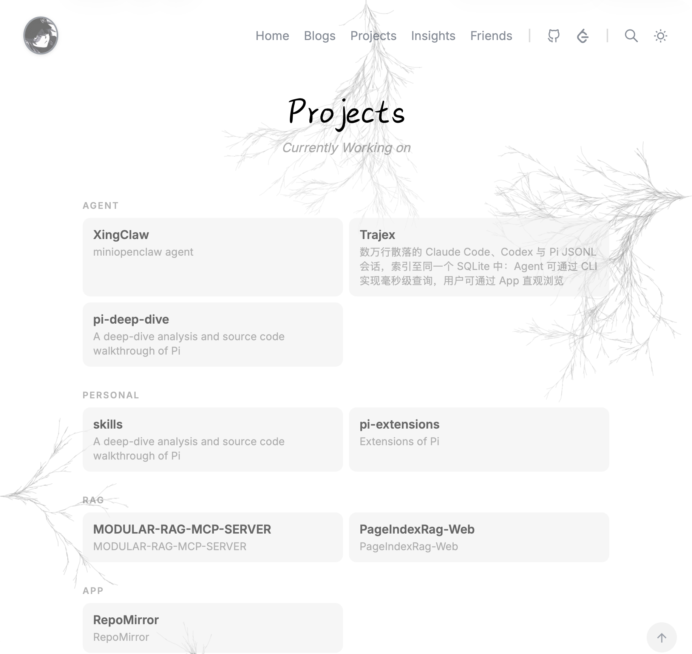

# Wutong-Yu-Blog

[](https://astro.build)
[](https://www.typescriptlang.org)
[](https://unocss.dev)
[](https://mdxjs.com)
[](https://pagefind.app)
[](https://pnpm.io)
[](LICENSE)

A streamlined Astro 5 personal site inspired by the Antfu-style visual language. This repository focuses on a small, opinionated feature set: homepage, blog, projects, insights, friends, and search, while keeping the codebase easy to extend.

## Home Page

The homepage uses a dedicated `HomeHeader` with a pure-CSS retro desktop illustration. It switches to a vertical layout on narrow screens, while the body presents the profile, stack, GitHub stats, and social links.


<p align="center">
  
</p>


<p align="center">
  
</p>
## Blogs Page

<p align="center">
  
</p>
### blog Page

<p align="center">
  
</p>
## Projects Page

Projects are grouped in a compact responsive grid with small category labels. The project `icon` field is optional, and the current project data is intentionally icon-free.

<p align="center">
  
</p>


## Insights Page

The `/insights/` page is currently cleared into a blank placeholder page. The route is kept so the page can be redesigned and rebuilt later.

## Friends Page

The request area uses a two-column email and submission-format panel that collapses to one column on mobile.

<p align="center">
  
</p>


## Overview

- Framework: Astro 5 + TypeScript
- Styling: UnoCSS + custom CSS
- Content: Markdown / MDX via Astro Content Collections
- Search: Pagefind (blogs only)
- UX: light/dark theme switching with view transitions
- Content extras: article TOC, reading-friendly blog layout, and an optional OG image generation pipeline

## Feature Highlights

- Home page at `/`
- Blog index at `/blogs/` and article pages at `/blogs/[slug]/`
- Project showcase page at `/projects/` with compact category grids and optional icons
- Insights page at `/insights/`, currently kept as a blank placeholder route for future redevelopment
- Friends page at `/friends/` with category-grouped cards, an email/submission-format panel, and light/dark theme support
- Full-text blog search powered by Pagefind
- Right-side article TOC for blog detail pages
- OG image generation remains available, but its global switch is currently disabled
- Four built-in background effects: `plum`, `dot`, `rose`, and `snow`
- Social links and navigation configured from a single config file

## Tech Stack

- `astro` for routing, static generation, and content rendering
- `@astrojs/mdx` for MDX support
- `unocss` for utility-first styling
- `astro-expressive-code` for code block presentation
- `pagefind` for static search indexing
- `sharp` + `satori` for image and OG generation
- `eslint` + `prettier` for code quality and formatting

## Requirements

- Node.js `18.20.8`, `20.9.0+`, or `22+`
- `pnpm@10.28.0`

## Quick Start

```bash
pnpm install
pnpm dev
```

Then open the local Astro dev server shown in the terminal.

## Available Commands

```bash
pnpm dev          # start local development server
pnpm check        # run Astro type/content checks
pnpm build        # create production build
pnpm preview      # preview the production build locally
pnpm lint         # run ESLint
pnpm lint:fix     # fix lint issues where possible
pnpm format       # check formatting with Prettier
pnpm format:write # format files with Prettier
```

## Routes

| Route | Purpose |
| :--- | :--- |
| `/` | Homepage with a custom header, retro desktop, and profile content |
| `/blogs/` | Blog index |
| `/blogs/[slug]/` | Blog post detail page |
| `/projects/` | Compact categorized project grid with optional icons |
| `/insights/` | Insights page: currently a blank placeholder route with only the base page shell |
| `/friends/` | Friends page: category-grouped cards, email/submission format, and page-level `cd ..` alignment |
| `/search/` | Search page powered by Pagefind |

## Content And Customization

| File | Purpose |
| :--- | :--- |
| `src/content/home/index.md` | Homepage body content |
| `src/content/blogs/**/*.{md,mdx}` | Blog posts rendered at `/blogs/` |
| `src/content/projects/data.json` | Project card data |
| `src/content/insights/**/*.{md,mdx}` | Insight content source files, not rendered on the page right now |
| `src/content/friends/data.json` | Friends card data |
| `src/content/schema.ts` | Collection schemas (page, post, project, insight, friend) |
| `src/config.ts` | Site metadata, nav items, social links, and feature switches |
| `astro.config.ts` | Astro integrations, Markdown pipeline, image config, and build settings |

### Main Config Entry Points

- `SITE` in `src/config.ts`: website URL, title, description, locale, image domains
- `UI` in `src/config.ts`: internal navs, social links, navbar layout, post/group display rules
- `FEATURES` in `src/config.ts`: TOC, search, slide animation, OG image defaults

## Project Structure

```text
src/
  components/
    backgrounds/  # Background, Dot, Plum, Rose, Snow
    base/         # Head, Link, Footer, Backdrop, PostMeta, Divider
    home/         # HomeHeader, TinyDesktop
    nav/          # NavBar, NavItem, NavSwitch
    toc/          # Toc, TocSidebar, TocItem
    views/        # RenderPage, RenderPost, ListView, GroupView, InsightsView, FriendsView
    widgets/      # LogoButton, SearchSwitch, ThemeSwitch, BackLink
  content/
    blogs/        # Blog posts (Markdown / MDX)
    home/         # Homepage content
    projects/     # Project data (JSON)
    insights/     # Insight content source files organized by year (currently not rendered)
    friends/      # Friends data (JSON)
    schema.ts     # Shared Zod schemas for all content collections
  layouts/        # BaseLayout, StandardLayout
  pages/          # Route definitions
  styles/         # main.css, prose.css, markdown.css
  utils/          # path, datetime, data, misc, toc helpers
plugins/          # remark/rehype plugins, OG helpers
public/           # Static assets such as favicon, fonts, and generated images
docs/             # Project notes and customization documents
```

## Architecture Notes

**Content flow**

```text
src/content/*                -> raw Markdown / MDX / JSON content
src/content.config.ts        -> schema validation and parsing
astro.config.ts + plugins/*  -> Markdown / MDX processing
src/pages/*                  -> route generation
src/layouts/*                -> page shell
src/components/views/*       -> page-level composition
src/components/* + styles/*  -> final UI output
```

**Cross-cutting files**

- `src/config.ts` centralizes site, UI, and feature configuration
- `src/types.ts` defines shared TypeScript types for config and features (including `BgType`)

## Documentation

Project-specific notes are kept in `docs/`:

- `docs/项目解析.md` - Full project architecture and data flow analysis
- `docs/feature/Insights模块更新说明.md` - Current Insights module status, wiring, and restoration notes
- `docs/feature/友链模块说明.md` - Friends module structure, data flow, and maintenance guide
- `docs/feature/文章TOC与响应式导航说明.md` - TOC behavior and responsive navigation details
- `docs/notes/Insights页面清空说明.md` - Change note for clearing the Insights page into a placeholder
- `docs/notes/页面调整.md` - Blog reading experience and page-level adjustments
- `docs/notes/页面间距统一.md` - Notes on page spacing fixes
- `docs/notes/2026-08-09-页面更新说明.md` - Summary of the latest home, blogs, projects, friends, and OG configuration updates
- `docs/notes/LogoButton图标替换说明.md` - Logo replacement from text to SVG with theme switching
- `docs/notes/字体修改.md` - Adding and applying local fonts

## Positioning

This repository is a trimmed variant of the original `astro-antfustyle-theme`. It removes less relevant modules and keeps a smaller, easier-to-maintain surface area.

Removed or excluded parts:

- Extra pages such as photos, shorts, changelog, feeds, streams, releases, and pull requests
- Unused integrations such as GitHub activity, RSS, Bluesky, and comments
- Upstream boilerplate metadata and demo-oriented assets

Retained core experience:

- Home, blog, blog detail, projects, insights, friends, and search
- Config-driven social links and navbar layout
- Blog-only search via Pagefind
- Article TOC on post pages
- Theme switching with view transitions
- Optional OG image generation pipeline (currently disabled globally)
- Multiple background effects (`plum`, `dot`, `rose`, `snow`)

MIT
