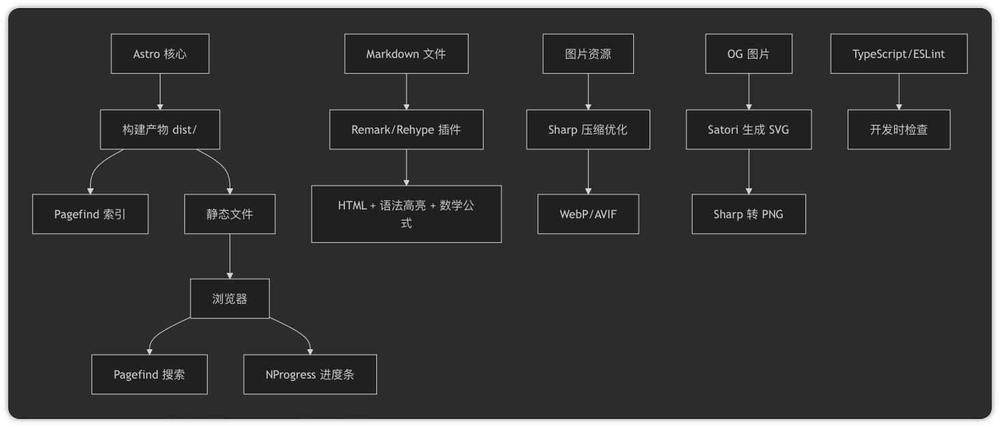
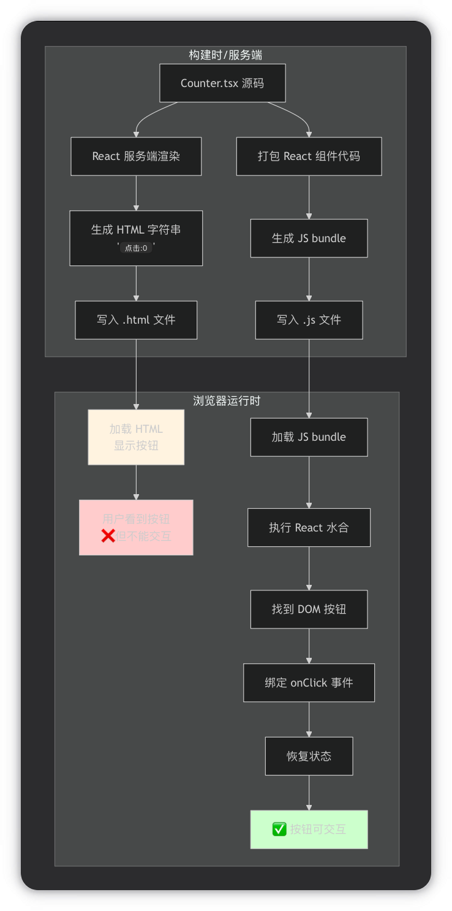

# `wutong-yu` 项目解析

> 本文目标是用“代码现在实际怎样工作”的方式，完整说明这个项目的目录结构、每层职责、调用链路、使用方法、构建与搜索行为，以及当前仍存在的注意事项。

## 1 项目定位

这是一个基于 **Astro 5** 的个人站点，视觉风格来自 `astro-antfustyle-theme`，但当前仓库已经收缩为一个更聚焦的内容站，核心只保留了：

- 首页 `/`
- 博客列表 `/blogs/`
- 博客详情 `/blogs/[...slug]/`
- 项目页 `/projects/`
- 灵感页 `/insights/`
- Pagefind 搜索
- 明暗主题切换
- 文章 TOC
- 四种背景效果 `plum / dot / rose / snow`
- 可选的 OG 图片生成链路（当前全局关闭）

它不是一个“通用主题演示站”，而是一个已经落到个人内容场景上的 Astro 站点。

### 当前真实路由

| 页面       | 路由                  | 入口文件                              | 数据来源                             |
| :------- | :------------------ | :-------------------------------- | :------------------------------- |
| 首页       | `/`                 | `src/pages/index.mdx`             | `src/content/home/index.md`      |
| 博客列表     | `/blogs/`           | `src/pages/blogs/index.mdx`       | `src/content/blogs/**/*.md(x)`   |
| 博客详情     | `/blogs/[...slug]/` | `src/pages/blogs/[...slug].astro` | `src/content/blogs/**/*.md(x)`   |
| 项目页      | `/projects/`        | `src/pages/projects.mdx`          | `src/content/projects/data.json` |
| Insights  | `/insights/`        | `src/pages/insights.mdx`          | `src/content/insights/**/*.md(x)` |
| Friends   | `/friends/`         | `src/pages/friends.mdx`           | `src/content/friends/data.json` |
| 404      | `/404`              | `src/pages/404.mdx`               | frontmatter                      |
| manifest | `/app.webmanifest`  | `src/pages/app.webmanifest.js`    | 运行时生成                            |

***

## 2 根目录结构

```text
wutong-yu/
├── plugins/                    Markdown 插件、OG 图片模板与生成逻辑
├── public/                     原样拷贝到构建输出的静态资源
│   ├── og-images/              自动生成或手动放置的 OG 图片
│   ├── favicon.svg             站点图标
│   ├── hhu.png                 首页 :link 指令使用的本地图片
│   ├── hku.png                 首页 :link 指令使用的本地图片
│   └── ...
├── src/
│   ├── components/             组件层
│   ├── content/                内容数据
│   ├── layouts/                布局层
│   ├── pages/                  路由层
│   ├── styles/                 样式层
│   ├── utils/                  工具函数
│   ├── config.ts               站点配置中心
│   ├── content.config.ts       Content Collections 定义
│   ├── env.d.ts                UnoCSS Attributify 类型扩展
│   └── types.ts                全局类型定义
├── astro.config.ts             Astro 主配置
├── ec.config.mjs               Expressive Code 配置
├── eslint.config.js            ESLint 配置
├── package.json                依赖与脚本
├── tsconfig.json               TypeScript 配置
├── unocss.config.ts            UnoCSS 配置
├── README.md                   简介文档
└── doc/项目解析.md             本文档
```

### 图片的存放和使用 —— `public/` 与 `src/assets/` 的边界

方式一：使用 `src/` 目录 (推荐用于优化)

这是 Astro 推荐的方式，用于享受其强大的**自动图片优化**功能。

- **位置：** 图片通常放在 `src/assets` 或 `src/images` 等 `src/` 下的目录中。
- **流程：** 你需要通过 `import` 语句导入图片。Astro 在构建时会处理这些图片，自动进行格式转换（如转为 WebP/AVIF）、尺寸压缩、生成响应式 `srcset` 等，以优化网站性能。
- **在你的 Schema 中：** 这正是 `image()` 验证器所期望的类型。你导入的图片元数据对象可以直接通过这个验证器。

```
1---
2// src/pages/index.astro
3import myCover from '../assets/cover.jpg'; // 导入 src/ 目录下的图片
4
5// myCover 是一个对象，可以被 image() 验证器验证
6---
```

方式二：使用 `public/` 目录 (用于静态资源)

这种方式更简单直接，适合处理不需要 Astro 构建流程干预的静态文件。

- **位置：** 图片放在项目根目录的 `public/` 文件夹下。
- **流程：** `public/` 目录下的所有文件在构建时会被**原封不动地复制**到最终的输出目录（`dist/`）。Astro 不会对这些图片进行任何优化处理。
- **引用方式：** 在代码中，你通过绝对路径（以 `/` 开头）来引用这些图片。
- **在你的 Schema 中：** 这种情况下，`cover` 字段就是一个指向图片路径的**字符串**，它会通过你 Schema 中的 `z.string().url()` 或者更合适的 `z.string()` 部分进行验证。

```
1---
2// src/pages/index.astro
3// 直接引用 public/ 目录下的图片路径
4const coverPath = '/images/cover.jpg'; 
5
6// coverPath 是一个字符串，可以被 z.string() 验证
7---
```

## 3 整体运行链路

这个项目更适合理解成 **4 层主干链路 + 2 个横向支撑文件 + 1 条图片处理分支**，而不是只有一条从上到下的直线。

### 4 层主干链路

```text
src/content/* 提供内容
        ↓
src/content.config.ts 定义集合
        ↓
src/content/schema.ts 校验并转换 frontmatter / JSON
        ↓
astro.config.ts + plugins/* 加工 Markdown / MDX 内容
        ↓
src/pages/* 定义路由入口
        ↓
src/layouts/* 搭页面骨架
        ↓
src/components/views/* 把内容数据组织成页面结构
        ↓
src/components/base|nav|widgets|toc|backgrounds/* 提供具体 UI 与交互
        ↓
src/styles/* 输出最终样式
```

#### 第 1 层：内容接入层

- `src/content/*` 是内容源，博客、首页文案、项目数据都从这里进入系统
- `src/content.config.ts` 告诉 Astro 有哪些内容集合、每个集合从哪里加载
- `src/content/schema.ts` 负责校验 frontmatter 或 JSON 结构，并把字段转换成可用类型，例如把 `pubDate` 转成 `Date`
- 这一层解决的问题是：**内容文件能不能被系统识别成合法数据**

#### 第 2 层：内容加工层

- `astro.config.ts` 为整个站点挂载 Markdown、MDX、UnoCSS、sitemap、图片配置等全局能力
- `plugins/*` 在 Markdown 渲染阶段继续加工内容，例如补阅读时长、OG 图、标题锚点、外链处理
- 图片处理链路也属于这一层：渲染器遇到 Markdown 图片或 `<Image />` 时，会决定它是走 `public/` 固定 URL，还是走 Astro 资源系统
- 这一层解决的问题是：**合法内容在进入页面前，还要经过哪些统一处理**

#### 第 3 层：页面组装层

- `src/pages/*` 决定页面入口和路由，例如 `/blogs/`、`/projects/`、`/insights/`
- `src/layouts/*` 负责统一页面骨架，例如页头、主体容器、背景和元信息布局
- `src/components/views/*` 负责把内容集合转换成页面结构，例如博客列表、文章详情、项目列表、Friends 分类页，以及 `Insights` 的页面占位组件
- 例如 `/blogs/` 页面会调用列表视图，而 `/insights/` 页面当前只挂载一个空白的 `InsightsView.astro` 作为后续开发占位
- 这一层解决的问题是：**内容数据如何被组织成一个具体页面**

#### 第 4 层：表现输出层

- `src/components/base|nav|widgets|toc|backgrounds/*` 提供更细粒度的 UI、导航、目录、按钮、背景和交互
- `src/styles/*` 负责全局样式、排版样式和页面样式
- 最终构建输出的就是 HTML、CSS、JS 和静态资源
- 这一层解决的问题是：**页面最终长什么样、用户怎么和它交互**

### 横向支撑文件

上面 4 层是“主干流向”，但项目里还有两类不会按箭头顺序执行、却会影响全流程的支撑文件。

- `src/config.ts`：全局配置入口
  - 提供 `SITE`、`UI`、`FEATURES` 等项目级配置
  - 会被 `astro.config.ts`、布局、组件、工具函数共同读取
  - 例如站点标题、基础路径、语言、导航、远程图片域名都在这里控制
- `src/types.ts`：全局类型约束
  - 描述配置对象、组件 props、功能开关等结构
  - 主要服务于 TypeScript 开发阶段，帮助编辑器提示、类型检查和重构
  - 它不是内容渲染流程里的某一步，但会横向约束很多代码模块

### 一句话总结

可以把这套系统理解成：

- `src/content/*` 提供原始内容
- `content.config.ts` 和 `schema.ts` 把内容接入并校验成结构化数据
- `astro.config.ts` 和 `plugins/*` 对内容做统一加工
- `src/pages/*`、`src/layouts/*`、`src/components/views/*` 把数据组装成页面
- `src/components/*` 与 `src/styles/*` 负责最终 UI 和样式输出
- `src/config.ts` 与 `src/types.ts` 则作为横向支撑，贯穿整个项目

***

## 4 依赖与脚本

### 4.1 `package.json`

这个文件决定四件事：

1. 项目使用哪些依赖
2. 项目有哪些开发/检查/构建命令
3. 构建后如何生成 Pagefind 搜索索引
4. 项目允许的 Node 版本范围

### 4.2 核心脚本

| 脚本               | 作用                                 |
| :--------------- | :--------------------------------- |
| `pnpm dev`       | 启动开发服务器                            |
| `pnpm check`     | 运行 `astro check`                   |
| `pnpm build`     | 构建静态站点                             |
| `pnpm preview`   | 预览构建结果                             |
| `pnpm lint`      | 运行 ESLint                          |
| `pnpm format`    | 检查 Prettier 格式                     |
| `pnpm postbuild` | 对 `dist/` 运行 Pagefind 建索引并删除 UI 资源 |

### 4.3 当前依赖分组



#### Astro 核心

- `astro`：Astro 框架核心，功能包括
  - 页面路由引擎
    ```
    src/pages/                    ← Astro 自动扫描此目录
    ├── index.astro              → 生成 /index.html
    ├── blogs/
    │   └── [...slug].astro      → 动态路由，生成 /blogs/xxx
    ├── projects/
    │   └── index.astro          → 生成 /projects/index.html
    ├── about.astro              → 生成 /about.html
    └── 404.astro                → 自定义 404 页面
    ```
  - 群岛架构：群岛的 JS 是**按需加载**的（只有用户滚动到或交互时才加载）

    Astro 支持**在同一项目中混用**多个 UI 框架

    如何在 Astro 中使用 React/Vue？

    1、安装 React 集成
    ```bash
    # 在你的项目中添加 React 支持
    pnpm add @astrojs/react react react-dom
    ```
    ```
    // astro.config.mjs
    import { defineConfig } from 'astro/config'
    import react from '@astrojs/react'
    
    export default defineConfig({
      integrations: [react()]
    })
    ```
    2、编写 React 组件（使用 JSX）
    ```
    // src/components/ReactCounter.tsx
    import { useState } from 'react'
    
    // ✅ React 组件用 JSX 语法
    export default function ReactCounter({ initial = 0 }) {
      const [count, setCount] = useState(initial)
      
      return (
        <div className="counter">
          <p>当前计数: {count}</p>
          <button onClick={() => setCount(count + 1)}>
            增加
          </button>
          <button onClick={() => setCount(count - 1)}>
            减少
          </button>
        </div>
      )
    }
    ```
    3、在 Astro 中使用
    ```
    ---
    // src/pages/index.astro
    import ReactCounter from '../components/ReactCounter'
    ---
    
    <!-- Astro 组件（.astro） -->
    <Layout>
      <h1>我的页面</h1>
      
      <!-- 使用 React 组件，需要 client:* 指令 -->
      <ReactCounter initial={10} client:load />
    </Layout>
    ```
    4、服务端渲染为静态 html，客户端水合+事件绑定

    *不写* *`client:*`，绝对没有 JS 发送到客户端*

    
  - 内容处理

    项目中的配置
    ```
    // src/content.config.ts
    import { glob, file } from 'astro/loaders'
    import { defineCollection } from 'astro:content'
    import { insightSchema, pageSchema, postSchema, projectSchema } from '~/content/schema'
    
    const pages = defineCollection({
      loader: glob({ base: './src/pages', pattern: '**/*.mdx' }),
      schema: pageSchema,
    })
    
    const home = defineCollection({
      loader: glob({ base: './src/content/home', pattern: 'index.{md,mdx}' }),
    })
    
    const blogs = defineCollection({
      loader: glob({ base: './src/content/blogs', pattern: '**/*.{md,mdx}' }),
      schema: postSchema,
    })
    
    const projects = defineCollection({
      loader: file('./src/content/projects/data.json'),
      schema: projectSchema,
    })
    
    const insights = defineCollection({
      loader: glob({ base: './src/content/insights', pattern: '**/*.{md,mdx}' }),
      schema: insightSchema,
    })
    
    export const collections = { pages, home, blogs, projects, insights }
    ```
    在页面中使用
    ```
    ---
    // src/pages/blogs/[...slug].astro
    import { getFilteredPosts } from '~/utils/data'
    
    const posts = await getFilteredPosts('blogs')
    ---
    ```
  - 静态生成

    构建时的行为
    ```
    pnpm build
    ```
    **Astro 的处理过程：**
    ```
    src/pages/index.astro     → dist/index.html
    src/pages/about.astro     → dist/about.html
    src/pages/blogs/[...slug].astro → 
      ├── 文章1 → dist/blogs/post1/index.html
      ├── 文章2 → dist/blogs/post2/index.html
      └── 文章3 → dist/blogs/post3/index.html
    
    组件中的图片优化：
      src/assets/hero.jpg → dist/_astro/hero.abc123.webp
    
    CSS 处理：
      所有 <style> 合并 → dist/_astro/combined.xyz789.css
    ```
- `@astrojs/mdx`：MDX（Markdown + JSX）是**独立的开源标准**，不是 Astro 专有的。**`@astrojs/mdx`** 是 Astro 团队的"适配器"，让 MDX 能在 Astro 中流畅工作

  **JSX 是 JavaScript 的语法扩展**，让你能在 JavaScript 代码中直接写类似 HTML 的标签
  | 规则  | 普通 HTML         | JSX                |
  | --- | --------------- | ------------------ |
  | 类名  | `class="..."`   | `className="..."`  |
  | 事件  | `onclick="..."` | `onClick={...}`    |
  | 变量  | 不支持             | `{变量名}`            |
  | 组件  | 不支持             | `<Header />`       |
  | 单标签 | `` 可有/无 /  | **必须闭合** `` |
  MDX 让你能在 Markdown 文章里插入互动组件

  React 组件（`.jsx` 文件）
  ```jsx
  // 独立的 React 组件文件
  export default function LikeButton() {
    const [liked, setLiked] = React.useState(false);
    
    return (
      <button onClick={() => setLiked(!liked)}>
        {liked ? '❤️ 已点赞' : '🤍 点赞'}
      </button>
    );
  }
  ```
  ```
  # 我的博客
  
  <YouTube id="abc123" />  <!-- 直接嵌入视频 -->
  <LikeButton />           <!-- 点赞按钮组件 -->
  <Chart data={salesData} /> <!-- 数据图表 -->
  
  这是一段文字 **加粗**。
  
  {/* 甚至能写 JavaScript 逻辑 */}
  {['苹果', '香蕉', '橙子'].map(fruit => (
    <div key={fruit}>{fruit}</div>
  ))}
  ```
- `@astrojs/check`
- `@astrojs/sitemap`
- `astro-robots-txt`

#### Markdown / HTML 处理

- `remark-directive`
- `remark-directive-sugar`
- `remark-imgattr`
- `remark-math`
- `rehype-katex`
- `rehype-callouts`
- `rehype-autolink-headings`
- `rehype-external-links`
- `rehype-wrap-all`

#### 搜索 / 阅读体验 / 媒体

- `pagefind`：一个**静态站点搜索库**，专门为 Astro、Hugo、Eleventy 等静态站点生成器设计
  ```
  dist/ 静态文件 -> [Pagefind 扫描] -> [提取内容] -> [建立索引] -> [生成搜索API文件] -> [浏览器端搜索]
  ```
- `nprogress`
- `reading-time`
- `p5`
- `sharp`
- `satori`
- `satori-html`

#### 工程化

- `typescript`
- `eslint`
- `eslint-plugin-astro`
- `eslint-plugin-jsx-a11y`
- `prettier`

***

## 5 六个核心配置文件

### 5.1 `astro.config.ts`

这是 Astro 的总配置，负责：

- 把 `SITE.website` 和 `SITE.base` 传给 Astro
- 开启 `sitemap()`、`robotsTxt()`、`unocss()`、`astroExpressiveCode()`、`mdx()`
- 把 `plugins/index.ts` 中定义的 `remark` / `rehype` 插件注入 Markdown 渲染链
- 配置 `image.domains` 与响应式图片行为
- 开启 `preserveScriptOrder`、`headingIdCompat` 等实验项

### 5.2 `ec.config.mjs`

这是 Expressive Code 的配置文件，负责：

- 代码块主题 `vitesse-dark / vitesse-light`
- 折叠代码块
- 行号插件
- 编辑器/终端框样式
- 代码字体与按钮样式

### 5.3 `unocss.config.ts`

这是 UnoCSS 的配置中心，负责：

- 开启 `presetWind3`、`presetAttributify`、`presetIcons`、`presetWebFonts`
- 扫描 `src/content`、`src/pages`、`src/layouts` 中的类名
- 注册 `transformerDirectives` 与 `transformerVariantGroup`
- 定义 `*-transition`、`shadow-custom_*`、`btn-*` 三组 shortcuts
- 通过 `safelist` 保证动态图标、动态类名和背景类不被摇掉
- 把 `UI.internalNavs`、`UI.socialLinks`、`projects/data.json` 中的图标加入 safelist

### 5.4 `tsconfig.json`

主要负责：

- 继承 Astro 严格模式配置
- 开启 `resolveJsonModule`
- 定义路径别名 `~/* -> ./src/*`

### 5.5 `eslint.config.js`

主要负责：

- 启用 JS / TS / Astro / JSX a11y 规则
- 合并 browser 与 node 全局变量
- 严格检查未使用变量
- 与 Prettier 兼容

### 5.6 `package.json`

它既是依赖清单，也是整个工程的命令入口；同时 `postbuild` 里还串上了 Pagefind 建索引逻辑，因此它也属于“运行行为配置”的一部分。

***

## 6. `src/` 根部四个站点级文件

### 6.1 `src/config.ts`

这是项目真正的“站点配置中心”，分为三块：

| 字段块        | 作用                              |
| :--------- | :------------------------------ |
| `SITE`     | 站点地址、标题、描述、作者、语言、图片域名           |
| `UI`       | 顶部导航、社交链接、导航布局、文章视图、项目卡片视图、外链策略 |
| `FEATURES` | 入场动画、OG 图片、TOC、搜索功能开关与参数        |

当前关键配置：

- 站点地址：`https://wutong-yu.site/`
- 内部导航：`/`、`/blogs`、`/projects`、`/insights`、`/friends`
- 搜索：仅收录 `blogs` collection
- OG：自动生成已开启，fallback 背景是 `plum`

在组件中如何使用

用法 1：直接导入使用

```
---
// src/components/nav/NavBar.astro
import { UI } from '../../config'
import { SITE } from '../../config'
---

<nav>
  <a href={SITE.base}>{SITE.title}</a>
  
  {UI.internalNavs.map(item => (
    <a href={item.path}>{item.text}</a>
  ))}
</nav>
```

用法 2：条件判断功能开关

```
---
import { FEATURES } from '../../config'

const [isSearchEnabled, searchConfig] = FEATURES.search
// isSearchEnabled = true
// searchConfig = { includes: ['blogs'], filter: false, ... }
---

{isSearchEnabled && (
  <SearchWidget config={searchConfig} />
)}
```

用法 3：在工具函数中使用

```typescript
// src/utils/datetime.ts
import { SITE } from '../config'

export function formatDate(date: Date): string {
  // 使用 SITE.lang 来格式化日期
  return new Intl.DateTimeFormat(SITE.lang).format(date)
}
```

### 6.2 `src/types.ts`

这是类型地基，定义了：

- 站点配置类型 `Site`
- UI 配置类型 `Ui`
- 功能开关类型 `Features`
- 导航项、社交项的显示模式与约束
- `BgType = 'plum' | 'dot' | 'rose' | 'snow'`
- TOC 配置与 Search 配置的结构

作用可以理解为：

```text
types.ts 先规定形状
        ↓
config.ts 再填写真实配置
        ↓
组件和工具函数按这些类型消费配置
```

### 6.3 `src/content.config.ts`

当前定义了 6 个内容集合：

| 集合         | 来源                                | 用途                 |
| :--------- | :-------------------------------- | :----------------- |
| `pages`    | `src/pages/**/*.mdx`              | 给页面 frontmatter 建模 |
| `home`     | `src/content/home/index.{md,mdx}` | 首页正文               |
| `blogs`    | `src/content/blogs/**/*.md(x)`    | 博客文章               |
| `projects` | `src/content/projects/data.json`  | 项目数据               |
| `insights` | `src/content/insights/**/*.md(x)` | Insights 内容源，当前页面暂未渲染 |
| `friends`  | `src/content/friends/data.json`   | 友情链接数据             |

注意：

- 当前真正参与页面渲染的主要是 `home`、`blogs`、`projects`、`insights`、`friends`
- `pages` collection 主要用于页面 frontmatter 建模，但没有像 `blogs` 那样被明显的数据函数广泛消费

### 6.4 `src/env.d.ts`

主要作用是给 UnoCSS Attributify 语法补类型，使 `u-*` 属性写法在 TS 环境下不报错。

***

## 7. 内容模型 `src/content/schema.ts`

这个文件用 Zod 约束内容数据结构。

### 7.1 `pageSchema`

用于页面级 frontmatter，字段包括：

- `title`
- `subtitle`
- `description`
- `bgType`
- `ogImage`

### 7.2 `postSchema`

用于博客文章 frontmatter，字段包括：

- 标题与描述：`title`、`subtitle`、`description`
- 组织信息：`tags`
- 封面：`cover`、`coverAlt`
- 时间：`pubDate`、`lastModDate`
- 阅读体验：`minutesRead`
- 行为开关：`ogImage`、`toc`、`search`、`draft`
- 扩展能力：`radio`、`video`、`platform`、`redirect`

### 7.3 `projectSchema`

用于项目数据 JSON，要求每项具备：

- `id`
- `link`
- `desc`
- `category`

`icon` 是可选字段。不填时卡片只渲染标题和描述；填写时仍支持 UnoCSS/Iconify 格式。

### 7.4 `insightSchema`

用于 `Insights` 内容 frontmatter，字段包括：

- 标题与描述：`title`、`description`
- 组织信息：`category`
- 时间：`pubDate`
- 配图：`image`、`imageAlt`
- 来源信息：`author`、`sourceUrl`
- 行为开关：`draft`

其中：

- `image` 和 `imageAlt` 都是可选项，不放图时会在视图层自动切成单列文本布局
- `sourceUrl` 要么是合法 URL，要么是空字符串

### 7.5 `friendSchema`

用于友链 JSON 数据，当前字段包括：

- 标识与名称：`id`、`name`
- 链接与头像：`link`、`avatar`
- 描述信息：`desc`、`siteLabel`
- 分组与顺序：`category`、`order`

其中：

- `avatar` 与 `siteLabel` 都允许为空字符串
- `order` 默认为 `999`，数值越小排序越靠前
- 友链系统已经移除 `featured`，当前只按 `order` 和名称排序

### 7.6 当前 schema 在项目中的作用

```text
Markdown / MDX / JSON 内容
        ↓
content.config.ts 绑定 schema
        ↓
Astro content layer 校验结构
        ↓
页面组件安全消费 frontmatter / data
```

***

## 8. 插件层 `plugins/`

插件层是这个项目的“内容增强层”。它并不直接渲染页面，而是在 Markdown 进入页面之前，对 AST、frontmatter 和产物做增强。

### 8.1 目录结构

```text
plugins/
├── index.ts                      remark / rehype 插件总装配
├── remark-reading-time.ts        自动计算阅读时长
├── remark-generate-og-image.ts   自动生成 OG 图片
└── og-template/
    ├── markup.ts                 OG 图片模板
    ├── base64.ts                 OG 背景图的 base64 数据
    └── Inter-Regular-24pt.ttf    OG 图片渲染字体
```

### 8.2 `plugins/index.ts`

这是 Markdown 插件总装配文件。

#### `remark` 阶段

- `remarkDirective`
- `remarkDirectiveSugar`
- `remarkImgattr`
- `remarkMath`
- `remarkReadingTime`
- `remarkGenerateOgImage`（仅在 `FEATURES.ogImage` 开启时注入）

#### `rehype` 阶段

- `rehypeHeadingIds`
- `rehypeKatex`
- `rehypeCallouts`
- `rehypeExternalLinks`
- `rehypeAutolinkHeadings`
- `rehypeWrapAll`

#### 它在整个项目中的作用

```text
Markdown / MDX 内容
        ↓
plugins/index.ts 统一装配插件
        ↓
remark 阶段处理指令、数学、阅读时长、OG 生成
        ↓
rehype 阶段处理标题锚点、外链、callout、表格包装
        ↓
RenderPage / RenderPost 输出最终 HTML
```

#### 在 Markdown 中使用这些功能

```markdown
<!-- 1. 徽章 -->
:badge[n] 显示 NEW

<!-- 2. 带图标的链接 -->
:link[GitHub]{href="https://github.com" class="github"}

<!-- 3. 带属性的图片 -->
{width=200 class=logo}

<!-- 4. 数学公式 -->
$E = mc^2$ 行内公式

$$ \int_0^\infty e^{-x^2} dx = \frac{\sqrt{\pi}}{2} $$ 块级公式

<!-- 5. 提示框 -->
:::tip
这是一个提示
:::

:::warning
警告内容
:::

<!-- 6. 表格（自动包装为可滚动） -->
| 列1 | 列2 |
|-----|-----|
| 内容1 | 内容2 |

<!-- 7. 标题自动生成 ID 和锚点 -->
## 我的标题
<!-- 生成 → <h2 id="我的标题">我的标题<a href="#我的标题">#</a></h2> -->
```

### 8.3 `plugins/remark-reading-time.ts`

作用：给文章自动写入 `frontmatter.minutesRead`。

#### 调用链路

```text
Markdown AST
   ↓
mdast-util-to-string 提取纯文本
   ↓
reading-time 计算分钟数
   ↓
写回 file.data.astro.frontmatter.minutesRead
```

#### 使用方式

- 如果文章里不写 `minutesRead`，则自动计算
- 如果写 `minutesRead: 0` 或 `false`，页面可以隐藏阅读时长
- 最终由 `RenderPost.astro` 和 `ListView.astro` 消费

### 8.4 `plugins/remark-generate-og-image.ts`

这是自动生成 OG 图片的核心插件。

#### 它做什么

- 在 Markdown/MDX 渲染阶段检查是否需要生成 OG 图
- 保证 `public/og-images/og-image.png` 这个 fallback 图存在
- 对启用了 `ogImage` 的页面/文章生成 `public/og-images/*.png`
- 对缺失的自定义图片给出 warning

#### 调用链路

```text
FEATURES.ogImage 开启
        ↓
remarkGenerateOgImage 注入 Markdown 渲染链
        ↓
遍历每个 md / mdx 文件
        ↓
跳过 draft / redirect / ogImage:false / 无 title 内容
        ↓
用 satori + sharp 生成 PNG
        ↓
输出到 public/og-images/
        ↓
Head.astro 读取并注入 og:image meta
```

#### 配置方式

##### 1. 全局配置

在 `src/config.ts` 中：

```ts
ogImage: false
```

当前全局开关已关闭，因此页面或文章中的 `ogImage: true` 不会触发新图生成。生成链路和既有图片仍保留；需要恢复时，将 `FEATURES.ogImage` 改回 `[true, { ... }]` 配置。

字段含义：

- `authorOrBrand`：生成图上展示的作者或品牌名
- `fallbackTitle`：默认兜底标题
- `fallbackBgType`：默认兜底背景类型

##### 2. 页面 / 文章 frontmatter 配置

```yaml
ogImage: true
```

含义：自动生成该页面/文章的 OG 图。

```yaml
ogImage: false
```

含义：关闭该页面/文章的 OG 自动生成。

```yaml
ogImage: custom.png
```

含义：使用 `public/og-images/custom.png` 作为自定义 OG 图。

#### 它在项目中有没有被用到

生成能力仍然存在，但当前被全局开关停用。

当前项目中：

- 首页 `src/pages/index.mdx`：`ogImage: false`
- 博客列表 `src/pages/blogs/index.mdx`：`ogImage: true`
- 博客文章：示例文章都为 `ogImage: true`
- 项目页 `src/pages/projects.mdx`：`ogImage: true`
- 404 页：`ogImage: false`

当前 `public/og-images/` 保留了静态图片：

- `og-image.png`
- `blogs.png`
- `projects.png`

#### 它最终有什么用

这些图片会被 `Head.astro` 注入到：

```html
<meta property="og:image" ...>
<meta property="twitter:image" ...>
```

因此在社交分享时，它会作为链接预览图使用，例如：

- 微信卡片预览
- X / Twitter 分享预览
- Discord / Telegram / Slack 链接卡片
- 其他支持 Open Graph / Twitter Card 的平台

### 8.5 `plugins/og-template/markup.ts`

负责定义 OG 图模板结构：

- 全图背景
- Astro 图标
- 作者 / 品牌名
- 页面标题

当前接受四种背景类型：

- `plum`
- `dot`
- `rose`
- `snow`

其中：

- `snow` 已经进入 `BgType` 与页面 frontmatter 的合法枚举
- `Snow.astro` 会在运行时渲染真实飘雪背景
- OG 模板里的 `snow` 当前复用 `dot` 的静态底图作为兜底视觉，不会生成动态雪景

### 7.6 `plugins/og-template/base64.ts`

这个文件很大，但职责非常单一：

- 存放 OG 背景图的 base64 数据
- 供 `markup.ts` 直接引用
- 避免在生成 OG 图时再去读额外图片文件

***

## 9. 内容数据层 `src/content/`

### 9.1 目录结构

```text
src/content/
├── blogs/
├── home/
│   └── index.md
├── insights/
│   ├── 2024/
│   │   └── 
│   ├── 2025/
│   │   └── 
│   └── 2026/
│       ├── 
├── projects/
│   └── data.json
└── schema.ts
```

### 9.2 每个内容文件的作用

| 文件                                          | 作用                                     |
| :------------------------------------------ | :------------------------------------- |
| `src/content/home/index.md`                                   | 首页正文内容                                   |
| `src/content/blogs/markdown-guide.md`                         | Markdown 渲染回归样例，用于检验标题、列表、代码块、表格、数学等展示   |
| `src/content/blogs/JUC并发编程/*.md`                            | 嵌套目录博客样例，用于验证多层级 slug、文内跳转和文章页 TOC 行为 |
| `src/content/insights/年份/*.md`                               | Insights 内容源，按年份归档保留，当前页面暂未渲染             |
| `src/content/blogs/本机Homebrew工具笔记.md`                            | 顶层博客样例，用于验证普通文章路由与渲染                    |
| `src/content/projects/data.json`                              | 项目卡片数据源                                  |
| `src/content/friends/data.json`                               | 友链卡片数据源，按分类进入 `/friends/` 页面渲染            |

### 9.3 `src/content/home/index.md`

这是首页正文的数据源。

当前内容包括：

- 个人介绍
- 学校与申请情况
- 技术栈链接
- GitHub 概览和语言统计图片
- GitHub、Instagram、Bilibili 与 X 社交链接

#### 这里的 `:link` 指令怎么用

当前首页使用了类似：

```md
:link[Hohai University]{id=https://www.hhu.edu.cn img=/hhu.png .rounded}
```

其中：

- `id=` 是跳转链接
- `img=` 是生成出来的 ``
- `.rounded` 是 class，会被 `markdown.css` 里的 `[data-link='custom-url'].rounded` 样式命中

#### `img=` 应该怎么写

在当前项目中，**更推荐写成外部 URL 或** **`public/`** **下的绝对路径**，例如：

- `img=/hhu.png`
- `img=https://github.com/antfu.png`

因为 `:link` 最终会输出原始 ``，不会像 Astro `Image` 那样自动处理本地资源。

### 9.4 `src/content/blogs/**/*.md(x)`

博客内容位于 `src/content/blogs/`，支持顶层文章和嵌套子目录文章。

例如：

- `src/content/blogs/本机Homebrew工具笔记.md`
- `src/content/blogs/JUC并发编程/JUC并发编程——多线程基础.md`

它们最终都会进入 `blogs` collection，并映射为：

- `/blogs/本机Homebrew工具笔记/`
- `/blogs/JUC并发编程/JUC并发编程——多线程基础/`

每篇文章至少建议包含：

```yaml
---
title: My Post
description: Short description
pubDate: 2026-05-03
ogImage: true
toc: true
search: true
---
```

#### 常见 frontmatter 字段的实际作用

| 字段                             | 作用                      |
| :----------------------------- | :---------------------- |
| `title`                        | 页面标题、搜索标题、OG 标题         |
| `description`                  | meta description 与分享描述  |
| `pubDate`                      | 列表排序与文章元信息              |
| `lastModDate`                  | 显示“Updated”时间           |
| `minutesRead`                  | 阅读时长，默认自动计算             |
| `cover`                        | 文章封面                    |
| `coverAlt`                     | 封面替代文本和可选 caption       |
| `ogImage`                      | 自动生成 / 禁用 / 指定自定义 OG 图片 |
| `toc`                          | 控制是否显示文章 TOC            |
| `search`                       | 控制是否进入搜索索引              |
| `draft`                        | 生产环境下隐藏草稿               |
| `redirect`                     | 列表点击后跳去外部 URL           |
| `radio` / `video` / `platform` | 在列表页补充媒体属性与平台信息         |

### 9.5 `src/content/projects/data.json`

这是项目页数据源。

每项结构形如：

```json
{
  "id": "project-name",
  "link": "https://example.com",
  "desc": "project description",
  "category": "Backend"
}
```

`icon` 为可选字段。当前项目数据全部省略它，卡片以文字为主。如果日后需要某个图标，可添加：

```json
"icon": "i-carbon:chat-bot"
```

格式为 `i-图标集 (Collection):图标名 (Icon)`。

处理链路：

```
data.json 的可选 icon 字段
        ↓
GroupItem.astro 条件渲染
        ↓
class={`group-card__icon ${item.icon}`}
        ↓
渲染成 <div class="group-card__icon i-carbon:user-feedback">
        ↓
UnoCSS presetIcons 处理 .i-carbon:user-feedback
        ↓
从 Iconify 获取 SVG 并注入 CSS
```

当前项目安装了 `@iconify/json`，`presetIcons` 从这个数据包解析 Carbon 及其他 Iconify 图标集。该依赖同时服务导航、搜索、主题切换、文章元信息等全站图标，不能因 Projects 省略图标而单独删除。

如果要用其他图标集，代码如下：

```typescript
// unocss.config.ts

// 1. 导入 collections
import { collections } from '@iconify-json/pixelarticons' 

export default defineConfig({
  presets: [
    presetIcons({
      // 2. 关键步骤：在这里注册 pixelarticons
      collections: {
        pixelarticons: collections, // 这行代码告诉 UnoCSS：pixelarticons 图标集是可用的
      },
    }),
  ],
})
```

还需要安装对应的图标数据包

```bash
npm install -D @iconify-json/pixelarticons
```

> 注意：UnoCSS 的 presetIcons 依赖于 Vite 的插件钩子来动态解析图标。如果缓存没更新，Vite 会认为“这个图标以前没出现过，我就不处理它”，导致 CSS 没生成
>
> 执行一下命令来刷新：
>
> ```bash
> rm -rf node_modules/.vite && npm run dev
> ```

#### 它在项目中的作用

```text
projects/data.json
        ↓
content.config.ts 加载为 projects collection
        ↓
GroupView.astro 按 category 分组
        ↓
GroupItem.astro 渲染项目卡片
```

### 9.6 `src/content/insights/年份/*.md(x)`

`Insights` 内容位于 `src/content/insights/`，当前按年份归档。

例如：

- `src/content/insights/2024/2024-08-09-clarity-through-subtraction.md`
- `src/content/insights/2026/2026-04-03-action-before-feeling.md`

它们最终都会进入 `insights` collection。相关数据结构和工具函数仍然保留，但当前 `/insights/` 页面没有继续消费这条链路。

每篇 Insight 建议包含：

```yaml
---
title: 我的新记录
description: 一句话描述
pubDate: 2026-05-14
category: Reflection
image: /og-images/index.png
imageAlt: image description
author: 作者名
sourceUrl: https://example.com
draft: false
---
```

常见 frontmatter 字段的实际作用：

| 字段 | 作用 |
| :-- | :-- |
| `title` | 节点标题 |
| `description` | 页面描述或补充摘要 |
| `pubDate` | 时间线排序与年份分组 |
| `category` | 节点顶部分类标签 |
| `image` | 右侧配图，留空则不渲染图片 |
| `imageAlt` | 图片替代文本 |
| `author` | 标题下方的引用署名 |
| `sourceUrl` | 引用出处链接 |
| `draft` | 生产环境下隐藏草稿 |

它在项目中的作用：

```text
src/content/insights/**/*.md
        ↓
content.config.ts 加载为 insights collection
        ↓
schema.ts / data.ts 中的能力仍可复用
        ↓
当前 `/insights/` 页面暂未读取并渲染这些内容
```

***

## 10. 工具函数 `src/utils/`

### 10.1 文件总览

| 文件            | 作用                   |
| :------------ | :------------------- |
| `path.ts`     | base path、尾斜杠与内部路由拼接 |
| `datetime.ts` | 日期格式化、年份提取、日志时间输出    |
| `data.ts`     | 博客、Insights 与 Friends 的过滤、排序、分组、阅读时长辅助 |
| `misc.ts`     | 面板淡入淡出、滚动锁定          |
| `toc.ts`      | TOC 树生成              |

### 10.2 `src/utils/path.ts`

提供 3 个路径工具：

- `withBasePath()`：拼 base path
- `ensureTrailingSlash()`：补尾斜杠
- `resolvePath()`：生成内部页面最终路径

它被这些地方使用：

- 导航项内部跳转
- Logo 回首页
- BackLink 返回上级
- manifest 图标与 start\_url
- 列表页 item 链接

### 10.3 `src/utils/datetime.ts`

提供：

- `formatDate()`：页面显示日期
- `getYear()`：文章分组年份
- `getCurrentFormattedTime()`：插件日志输出时间

### 10.4 `src/utils/data.ts`

这是内容列表数据层的核心工具文件。

它负责：

- `parseTuple()`：解析搜索分页参数
- `getMinutesRead()`：统一 minutesRead 的最终值
- `getFilteredPosts('blogs')`：开发环境不过滤草稿，生产环境过滤草稿
- `getSortedPosts()`：按 `pubDate` 倒序排序
- `getGroupedPostsByYear()`：按年份分组博客列表，并补上阅读时长
- `getFilteredInsights('insights')`：开发环境不过滤草稿，生产环境过滤草稿
- `getSortedInsights()`：按 `pubDate` 倒序排序 `Insights`
- `getGroupedInsightsByYear()`：按年份分组 `Insights` 数据，供后续恢复页面时复用
- `getSortedFriends('friends')`：按 `order` 与名称排序友链
- `getGroupedFriendsByCategory('friends')`：按分类分组友链卡片数据

#### 真实调用链路

```text
src/content/blogs/**/*.md(x)
        ↓
getFilteredPosts('blogs')
        ↓
getSortedPosts()
        ↓
getGroupedPostsByYear()
        ↓
ListView.astro
        ↓
ListItem.astro
```

`Insights` 相关工具函数当前保留，但页面侧链路已经断开，现状更接近：

```text
src/content/insights/**/*.md(x)
        ↓
content.config.ts + schema.ts
        ↓
getFilteredInsights('insights') / getSortedInsights() / getGroupedInsightsByYear()
        ↓
当前未接入 `/insights/` 页面渲染
```

`Friends` 的调用链路则是：

```text
src/content/friends/data.json
        ↓
getSortedFriends('friends')
        ↓
getGroupedFriendsByCategory('friends')
        ↓
FriendsView.astro
```

### 10.5 `src/utils/misc.ts`

主要给面板类交互使用：

- `lockScroll()`：打开遮罩时锁定页面滚动
- `unlockScroll()`：关闭时恢复滚动
- `toggleFadeEffect()`：控制 backdrop / search / nav 面板显隐动画

### 10.6 `src/utils/toc.ts`

负责：

- 过滤指定层级的标题
- 把 Markdown headings 转成树状 TOC 数据
- 在标题层级不连续时补 filler 节点，确保树结构正确

***

## 11. 全局样式 `src/styles/`

### 11.1 文件总览

| 文件             | 负责内容                                                      |
| :------------- | :-------------------------------------------------------- |
| `main.css`     | 全站变量、滚动条、NProgress、入场动画、搜索面板、TOC、小标签滚动                    |
| `prose.css`    | 基础排版：标题、段落、列表、代码块、表格、图片等                                  |
| `markdown.css` | Markdown 增强：callout、标题锚点、`:link`、`:badge`、视频、外链图标、KaTeX 等 |

### 11.2 `main.css`

它是全站基础层，负责：

- 亮暗主题变量 `--c-bg` / `--c-text`
- `NProgress` 顶部进度条
- 滚动条样式
- `slide-enter` 入场动画
- 面板淡入淡出动画
- 搜索结果样式
- TOC 激活态样式
- tag 横向滚动区域样式

### 11.3 `prose.css`

它是正文基础排版层，负责：

- `.prose` 最大宽度与行高
- 标题、段落、列表、blockquote
- 行内代码与代码块
- 表格、图片、视频、figure
- 列表缩进和 marker 样式

### 11.4 `markdown.css`

它是 Markdown 增强层，负责：

- `rehype-callouts` 主题
- KaTeX 样式导入
- Expressive Code 细节样式
- 标题锚点 `.header-anchor`
- `:link` 指令样式
- `:badge` 指令样式
- `.rds-video` 视频嵌入样式
- 外链新标签图标样式

#### `:link` 样式定义位置

当前 `:link` 的主要样式在这里：

- `[data-link='github-acct']`
- `[data-link='github-repo']`
- `[data-link='npm-pkg']`
- `[data-link='custom-url'].rounded`
- `[data-link='custom-url'].square`

也就是说，`:link[...]` 的 HTML 结构由 `remark-directive-sugar` 生成，而视觉样式由 `markdown.css` 接管。

***

## 12. 布局层 `src/layouts/`

### 12.1 文件总览

| 文件                     | 作用      |
| :--------------------- | :------ |
| `BaseLayout.astro`     | 全站最外层布局 |
| `StandardLayout.astro` | 标准内容页布局 |

### 12.2 `BaseLayout.astro`

它负责：

- 引入全局样式
- 注入 `Head.astro`
- 根据 `bgType` 加载背景组件
- 渲染导航栏
- 渲染主内容区
- 在非首页显示 `BackLink`
- `/insights` 页面仍保留一组单独的 `BackLink` 容器宽度配置，这是之前页面结构留下的路由级差异
- 渲染 Footer
- 渲染回顶按钮
- 渲染 `Backdrop`
- 监听 `astro:before-preparation` / `astro:page-load` 驱动 `NProgress`

### 12.3 `StandardLayout.astro`

它负责：

- 页面标题与副标题
- `slot="head"` 元信息区域
- `slot="article"` 正文区域
- 默认插槽容器
- 给正文输出 `data-pagefind-body` 与 `data-pagefind-filter`

#### 它在搜索中的作用

Pagefind 只会索引被打上 `data-pagefind-body` 的区域，因此搜索功能是否覆盖页面，和 `StandardLayout.astro` 这一层直接相关。

***

## 13. 基础组件 `src/components/base/`

### 13.1 文件总览

| 文件                   | 作用                                                 |
| :------------------- | :------------------------------------------------- |
| `Head.astro`         | SEO、OG、Twitter Card、JSON-LD、主题初始化、manifest、sitemap |
| `Link.astro`         | 统一内链 / 外链行为                                        |
| `Backdrop.astro`     | 面板遮罩与面板关闭逻辑                                        |
| `Footer.astro`       | 页脚版权与 Astro 链接                                     |
| `Categorizer.astro`  | Blogs 的大号透明年份标题与 Projects 的紧凑分类标签                       |
| `DesktopAside.astro` | 桌面端 TOC 外壳                                         |
| `Divider.astro`      | 导航分隔线                                              |
| `PostMeta.astro`     | 文章日期、更新时间、阅读时长、标签                                  |
| `PostCover.astro`    | 文章封面图与 caption                                     |
| `Warning.astro`      | warning callout 封装                                 |

### 13.2 `Head.astro`

这是 SEO 与分享信息的核心组件。

#### 它负责什么

- 生成 `<title>` 与 `description`
- 生成 canonical URL
- 输出 Open Graph 与 Twitter Card 元标签
- 输出 JSON-LD
- 初始化主题与 `<meta name="theme-color">`
- 引入 favicon、manifest、sitemap
- 注入 `ClientRouter`

#### OG 图优先级

`Head.astro` 里的 `og:image` 取值优先级是：

```text
frontmatter 指定的自定义 OG 图
        ↓
当前路径 basename 对应的自动生成图
        ↓
/public/og-images/og-image.png fallback 图
```

### 13.3 `Link.astro`

它统一处理：

- 是否外链
- 是否新标签打开
- `rel` 与 `target`
- 外链新标签警告图标
- 自定义外链 cursor

项目里几乎所有 `<a>` 行为都建议走这里，以保持一致性。

### 13.4 `Backdrop.astro`

负责：

- 渲染移动端遮罩层
- 点击遮罩关闭 `nav-panel` 或 `search-panel`
- 监听 `Tab` / `Escape`，焦点离开或按 Escape 时自动关闭面板

### 13.5 `PostMeta.astro`

根据 `UI.postView.postMetaStyle` 决定用：

- minimal 文本样式
- icon 图标样式

来展示：

- 发布时间
- 更新时间
- 阅读时长
- 标签

***

## 14. 导航、搜索、主题与小部件层

### 14.1 `src/components/nav/`

| 文件                | 作用                       |
| :---------------- | :----------------------- |
| `NavBar.astro`    | 按 `UI.navBarLayout` 组装导航 |
| `NavItem.astro`   | 渲染单个导航项 / 社交项            |
| `NavSwitch.astro` | 移动端汉堡菜单与面板               |

#### 调用链路

```text
BaseLayout.astro
    ↓
NavBar.astro
    ↓
NavItem.astro / SearchSwitch.astro / ThemeSwitch.astro / NavSwitch.astro
```

### 14.2 `NavBar.astro`

它根据 `UI.navBarLayout.left/right/mergeOnMobile` 决定：

- 导航项在左还是右
- 是否插入 divider
- 移动端是否合并为汉堡面板
- 是否显示搜索按钮与主题按钮

### 14.3 `NavItem.astro`

它根据 `type` 区分：

- `internal`：走 `resolvePath(item.path)`
- `social`：直接外链跳转，并带 `rel="me"`

### 14.4 `NavSwitch.astro`

移动端导航面板组件，负责：

- 渲染打开按钮
- 渲染 `nav-panel`
- 点击按钮时通过 `toggleFadeEffect()` 打开 panel 与 backdrop

### 14.5 `src/components/widgets/`

| 文件                   | 作用                     |
| :------------------- | :--------------------- |
| `BackLink.astro`     | `cd ..` 风格返回上一级        |
| `LogoButton.astro`   | 左上角站点 Logo             |
| `SearchSwitch.astro` | 搜索按钮、搜索面板与 Pagefind 逻辑 |
| `ThemeSwitch.astro`  | 明暗主题切换                 |
| `ToTopButton.astro`  | 回到顶部                   |

### 14.6 `SearchSwitch.astro`

这是当前项目最复杂的前端交互组件之一。

#### 它负责什么

- 渲染搜索按钮
- 渲染搜索面板 `<search-panel>`
- 在开发环境显示 fake results
- 在生产环境动态加载 `pagefind.js`
- 支持键盘导航、分页加载、结果高亮

#### 当前配置来自哪里

来自 `src/config.ts` 中的：

```ts
search: [
  true,
  {
    includes: ['blogs'],
    filter: false,
    navHighlight: true,
    batchLoadSize: [true, 5],
    maxItemsPerPage: [true, 3],
  },
]
```

#### 开发环境为什么只显示模拟结果

因为 Pagefind 的索引文件只会在 `pnpm build` 之后生成到 `dist/pagefind/`。

所以：

- `pnpm dev`：显示模拟结果，用于验证 UI 是否可用
- `pnpm build && pnpm preview`：才会搜索真实页面内容

#### 当前真实搜索范围

按当前代码，Pagefind 只会索引带 `data-pagefind-body` 的页面正文区域。

当前实现里：

- 博客详情页会通过 `RenderPost.astro` 把 `isSearchable` 和 `searchFilter` 传给 `StandardLayout.astro`
- `StandardLayout.astro` 再根据这些值输出 `data-pagefind-body`
- 首页、博客列表页、项目页、Insights 页当前默认不进入正文索引范围

#### 搜索调用链路

```text
FEATURES.search 开启
        ↓
NavBar.astro 注入 SearchSwitch.astro
        ↓
RenderPost.astro 计算 isSearchable / searchFilter
        ↓
StandardLayout.astro 输出 data-pagefind-body
        ↓
pnpm build 后 postbuild 运行 pagefind 建索引
        ↓
生产环境 SearchSwitch 动态加载 pagefind.js 搜索 dist/pagefind 索引
```

### 14.7 `ThemeSwitch.astro`

负责：

- 同步 `localStorage.theme`
- 同步 `aria-checked`
- 更新 `<meta name="color-scheme">` 与 `<meta name="theme-color">`
- 在支持的浏览器下使用 View Transition API 实现主题切换动画

***

## 15. 背景层与 TOC 层

### 15.1 `src/components/backgrounds/`

| 文件                 | 作用            |
| :----------------- | :------------ |
| `Background.astro` | 按类型分发背景       |
| `Dot.astro`        | canvas 点阵流动背景 |
| `Plum.astro`       | canvas 枝状生长背景 |
| `Rose.astro`       | 花瓣旋转背景        |
| `Snow.astro`       | canvas 飘雪背景     |

### 15.2 背景组件的项目作用

这些背景不会承载业务逻辑，但会直接影响页面氛围与包体积。

当前：

- `dot`、`plum`、`snow` 都是自定义元素 + 原生 Canvas
- `rose` 是自定义元素 + CSS transform 过渡动画

#### `Dot.astro` 的速度控制方式

`Dot.astro` 当前不是通过鼠标交互驱动，而是通过“时间流速 + 最大刷新频率”共同控制动画。

关键参数包括：

- `SCALE`：控制波场尺度，值越大，整体流动变化越平缓
- `LENGTH`：控制每个点的线段长度
- `SPACING`：控制点阵密度，值越小点越密
- `FPS`：控制最大绘制刷新频率，也就是每秒最多重绘多少次
- `t = now / ...`：控制时间推进速度，除数越小，图案变化越快

其中 `FPS` 的实际作用是：

```ts
if (now - this.lastFrameAt >= 1000 / BgDotElement.FPS) {
  this.draw(now)
  this.lastFrameAt = now
}
```

这意味着：

- `FPS = 20` 时，最多约每 `50ms` 绘制一次
- `FPS = 40` 时，最多约每 `25ms` 绘制一次

需要区分：

- `FPS` 控制的是“多久画一帧”
- `t = now / ...` 控制的是“每一帧里的图案变化有多快”

所以如果想让 `dot` 背景更快：

- 提高 `FPS`，会让动画更顺滑
- 减小 `t = now / ...` 里的除数，会让流动速度本身更快

#### `Plum.astro` 的速度控制方式

`Plum.astro` 是一个递归分枝的 Canvas 背景，速度主要由“多久处理一批待绘制分枝”来决定。

关键参数包括：

- `LEN`：单次分枝的长度
- `THRESHOLD`：决定前期与后期分枝扩散概率
- `INTERVAL`：控制两次实际绘制之间的最小时间间隔

其中最直接影响速度的是：

```ts
const INTERVAL = 1000 / 200
```

以及：

```ts
if (now - lastTime < INTERVAL) return
lastTime = now
```

这意味着：

- `INTERVAL` 越小，绘制批次越频繁，枝条长得越快
- `INTERVAL` 越大，绘制批次越稀疏，枝条长得越慢

可以把它理解为：

- `Plum` 没有像 `Dot` 那样的连续波场时间参数
- 它更像“按批次推进”的生成动画
- 所以提速时，优先调整 `INTERVAL`

#### `Rose.astro` 的速度控制方式

`Rose.astro` 的背景速度主要不是靠 `requestAnimationFrame`，而是靠 CSS `transform` 过渡时长控制。

当前关键参数是花瓣节点上的这段样式：

```html
transition-(transform duration-17000 ease-[cubic-bezier(0,0,.6,.95)])
```

它的含义是：

- 每次 `#animate()` 更新花瓣的 `transform`
- 浏览器会用约 `17000ms` 的过渡时间，把旧状态缓慢过渡到新状态

因此：

- `duration` 越大，花瓣旋转和缩放越慢
- `duration` 越小，花瓣变化越快

同时，`Rose.astro` 还会受这些参数影响：

- `scaleRange`：控制每朵花的缩放范围
- `rotationRange`：控制每朵花的额外旋转扰动
- `topRange` / `leftRange`：控制花朵位置变化范围

需要区分：

- `duration` 决定“从一个状态过渡到下一个状态要多久”
- `scaleRange`、`rotationRange`、`topRange`、`leftRange` 决定“变化到哪里”

#### `Snow.astro` 的速度控制方式

`Snow.astro` 采用自定义元素 + Canvas 的方式渲染雪花，速度由“最大帧率 + 单个雪花下落速度 + 横向摆动风场”共同决定。

关键参数包括：

- `FPS`：控制每秒最多重绘多少次
- `BASE_DENSITY`：按视口面积换算雪花数量，值越小雪越密
- `MIN_FLAKES` / `MAX_FLAKES`：限制最少与最多雪花数量，避免过 sparse 或过重
- `speedY`：每片雪花的纵向下落速度，和 `depth` 一起决定远近层次
- `speedX` / `sway` / `wind`：共同决定横向漂移与轻微摇摆

其中刷新频率的控制逻辑是：

```ts
if (now - this.lastFrameAt >= 1000 / BgSnowElement.FPS) {
  this.draw(now, now - this.lastFrameAt)
  this.lastFrameAt = now
}
```

雪量密度的控制逻辑是：

```ts
const count = this.clamp(
  Math.round(area / BgSnowElement.BASE_DENSITY),
  BgSnowElement.MIN_FLAKES,
  BgSnowElement.MAX_FLAKES
)
```

这意味着：

- `FPS` 越高，雪花刷新越顺滑
- `BASE_DENSITY` 越小，同样屏幕面积下出现的雪花越多
- `speedY` 越大，雪花下落越快
- `wind` 与 `sway` 越大，左右飘动越明显

`Snow.astro` 还会根据明暗主题切换绘制颜色：

- 浅色模式下使用偏冷的灰蓝色雪点，避免纯白过亮
- 深色模式下使用更亮的冷白色雪点，保证背景可见但不过曝

### 15.3 `src/components/toc/`

| 文件                 | 作用                     |
| :----------------- | :--------------------- |
| `Toc.astro`        | TOC 行为层：监听标题进入视口，更新激活项 |
| `TocSidebar.astro` | 桌面端 TOC 列表结构层          |
| `MobileTocControl.astro` | 小宽度下的目录按钮与目录卡片 |
| `TocItem.astro`    | 递归渲染目录节点               |

#### TOC 调用链路

```text
RenderPost.astro
    ↓
Toc.astro
    ↓
DesktopAside.astro + MobileTocControl.astro
    ↓
TocSidebar.astro / TocItem.astro
```

#### TOC 的控制开关

- 全局开关：`FEATURES.toc`
- 单篇文章开关：frontmatter `toc: true / false`
- 当前只有 `headings.length > 0` 时才会实际挂载 TOC
- `Toc.astro` 只处理带 `data-toc-link` 的真实目录链接，避免把 `Skip toc` 之类的辅助链接混入高亮映射

***

## 16. 视图组件 `src/components/views/`

### 16.1 文件总览

| 文件                 | 作用              |
| :----------------- | :-------------- |
| `RenderPage.astro` | 渲染普通内容条目        |
| `RenderPost.astro` | 渲染博客详情          |
| `ListView.astro`   | 渲染博客列表          |
| `ListItem.astro`   | 渲染单个博客列表项       |
| `GroupView.astro`  | 渲染项目页分组         |
| `GroupItem.astro`  | 渲染项目卡片网格        |
| `InsightsView.astro` | 渲染 Insights 空白占位页 |
| `FriendsView.astro` | 渲染 Friends 分类卡片页 |

### 16.2 `RenderPage.astro`

负责：

- 通过 `getEntry(collectionType, id)` 读取内容集合项
- 调 `render(content)` 生成 `Content`
- 用于首页这类普通内容页

### 16.3 `RenderPost.astro`

这是博客详情页的核心视图组件。

它负责：

- `render(post)` 得到正文、标题树、插件 frontmatter
- 计算最终阅读时长
- 计算是否显示 TOC
- 计算是否允许进入搜索索引
- 组装 `BaseLayout + StandardLayout + PostMeta + Toc + DesktopAside + MobileTocControl + PostCover + Content`
- 在开发环境下显示 draft warning

#### 博客详情真实调用链路

```text
src/pages/blogs/[...slug].astro
    ↓
RenderPost.astro
    ↓
render(post)
    ↓
PostMeta + Toc(DesktopAside + MobileTocControl) + PostCover + Content
```

### 16.4 `ListView.astro`

负责：

- 从 `getGroupedPostsByYear(collectionType)` 拉取并分组博客
- 根据年份输出 `Categorizer`
- 渲染多个 `ListItem`

#### `collectionType` 与 `urlPath` 的区别

这里是当前项目一个很关键的实现细节：

- `collectionType="blogs"`：表示数据来源是 `blogs` collection
- `urlPath="blogs"`：表示列表项链接使用 `/blogs/` 作为 URL 前缀

在当前项目里，这两个值刚好保持一致；同时组件仍保留 `urlPath` 这个入口，方便以后把“数据来源”和“页面前缀”拆开控制。

### 16.5 `ListItem.astro`

负责：

- 输出单条博客链接
- 展示标题、日期、阅读时长、媒体属性、平台、标签
- 处理 `redirect` 外链文章

当前链接生成逻辑是：

```text
redirect 优先
    ↓
否则使用 /${urlPath || collectionType || 'blogs'}/${postSlug}/
```

### 16.6 `GroupView.astro`

负责：

- 读取 `projects` collection
- 按 `category` 分组
- 每组输出一个紧凑版 `Categorizer`
- 再交给 `GroupItem.astro` 渲染卡片网格
- 通过 `.project-groups` 和 `.project-group` 分别控制分类间距与标题/卡片间距

### 16.7 `GroupItem.astro`

负责：

- 渲染项目卡片网格
- 输出项目标题与描述，并仅在 `icon` 存在时渲染图标
- 使用 `minmax(240px, 1fr)` 的紧凑自适应网格，移动端改为单列
- 保留 hover 时的轻微背景反馈

### 16.8 `InsightsView.astro`

这是 `Insights` 页面的占位视图组件。

它负责：

- 输出一个空白 section 作为页面占位
- 为 `/insights/` 路由保留稳定的组件挂载点
- 为后续重新开发保留最小视图入口

当前页面结构可以理解为：

```text
空白占位节点
```

### 16.9 `FriendsView.astro`

这是 `Friends` 页面的核心视图组件。

它负责：

- 调用 `getGroupedFriendsByCategory('friends')` 获取按分类分组的数据
- 输出每个分类标题和该分类下的友链数量
- 用整卡链接渲染头像、站点名、补充说明与描述
- 当头像缺失时，使用站点名称首字母作为回退占位
- 在页面底部挂载 `FriendsApplyPanel.astro`，展示联系邮箱与申请参考格式
- 通过局部 CSS 变量适配浅色与深色主题

当前页面结构可以理解为：

```text
页面标题 / 副标题
    ↓
Friends 主容器
    ↓
分类标题 + 数量
    ↓
四列友链卡片网格
    ↓
申请友链区块
```

***

## 17. 页面入口 `src/pages/`

| 文件                      | 作用                      |
| :---------------------- | :---------------------- |
| `index.mdx`             | 首页入口，读取 `home/index.md` |
| `blogs/index.mdx`       | 博客列表入口                  |
| `blogs/[...slug].astro` | 博客详情动态路由                |
| `projects.mdx`          | 项目页入口                   |
| `insights.mdx`          | Insights 页面入口           |
| `friends.mdx`           | Friends 页面入口            |
| `404.mdx`               | 404 页面                  |
| `app.webmanifest.js`    | 输出 PWA manifest         |

### 17.1 `src/pages/index.mdx`

首页 frontmatter 当前为：

- `title: Wutong Yu`
- `subtitle: INTJ ｜ Unwavering to the end`
- `bgType: dot`
- `ogImage: false`

它通过：

```text
BaseLayout
    ↓
StandardLayout(head slot)
    ↓
HomeHeader(title + subtitle) + TinyDesktop
    ↓
RenderPage(collectionType='home', id='index')
```

来读取 `src/content/home/index.md`。

### 17.2 `src/pages/blogs/index.mdx`

这是博客列表页入口。

它负责：

- 设置页面级 frontmatter
- 当前副标题为 `Record my Trajectory`
- 使用 `ListView collectionType="blogs" urlPath="blogs"`
- 把页面最终渲染为 `/blogs/`

### 17.3 `src/pages/blogs/[...slug].astro`

这是博客详情动态路由。

#### 调用链路

```text
getFilteredPosts('blogs')
    ↓
为每个 post 生成 params.slug = post.id
    ↓
RenderPost {post}
```

### 17.4 `src/pages/projects.mdx`

通过 `GroupView collectionType="projects"` 渲染项目页，当前副标题为 `Currently Working on`。

### 17.5 `src/pages/insights.mdx`

这是 `Insights` 页面的入口文件。

它负责：

- 提供页面级 frontmatter，例如 `title`、`description`
- 通过 `BaseLayout` 组装最基础的页面骨架
- 挂载 `InsightsView.astro` 作为页面主体
- 不再提供 `subtitle`、`bgType: snow`、`ogImage`、`StandardLayout` 与自定义正文容器

当前调用关系是：

```text
BaseLayout
    ↓
InsightsView
```

### 17.6 `src/pages/friends.mdx`

这是 `Friends` 页面的入口文件。

它负责：

- 提供页面级 frontmatter，例如 `title`、`subtitle`、`description`、`bgType`、`ogImage`
- 当前页面 frontmatter 使用 `bgType: false`
- 通过 `BaseLayout + StandardLayout` 组装页面骨架
- 挂载 `FriendsView.astro` 作为页面主体
- 底部 `cd ..` 返回链接由 `BaseLayout` 按 `/friends` 路由单独控制宽度、左对齐与间距

当前调用关系是：

```text
BaseLayout
    ↓
StandardLayout(isCentered=true)
    ↓
FriendsView
```

### 17.7 `src/pages/404.mdx`

目前是一个很简短的 404 页面，正文只有：

```text
Nice to meet you tho!
```

它可以工作，但文案仍然偏模板化。

### 17.8 `src/pages/app.webmanifest.js`

运行时生成站点 manifest，内容包括：

- `name`
- `short_name`
- `description`
- 图标 `icon-192.png` / `icon-512.png` / `icon-mask.png`
- `scope`
- `start_url`
- `display`

***

## 18. 关键页面链路总览

### 18.1 首页链路

```text
src/pages/index.mdx
    ↓
BaseLayout.astro
    ↓
StandardLayout.astro
    ↓
RenderPage.astro
    ↓
getEntry('home', 'index')
    ↓
src/content/home/index.md
```

### 18.2 博客列表链路

```text
src/pages/blogs/index.mdx
    ↓
ListView.astro
    ↓
getGroupedPostsByYear('blogs')
    ↓
getFilteredPosts('blogs') + getSortedPosts()
    ↓
ListItem.astro
    ↓
/blogs/[...slug]/
```

### 18.3 博客详情链路

```text
src/pages/blogs/[...slug].astro
    ↓
getStaticPaths()
    ↓
RenderPost.astro
    ↓
render(post)
    ↓
StandardLayout(data-pagefind-body)
    ↓
PostMeta / Toc / DesktopAside / MobileTocControl / PostCover / Content
```

### 18.4 项目页链路

```text
src/pages/projects.mdx
    ↓
GroupView.astro
    ↓
getCollection('projects')
    ↓
按 category 分组
    ↓
GroupItem.astro
```

### 18.5 Insights 页链路

```text
src/pages/insights.mdx
    ↓
BaseLayout.astro
    ↓
InsightsView.astro
    ↓
空白占位节点
```

### 18.6 Friends 页链路

```text
src/pages/friends.mdx
    ↓
BaseLayout.astro
    ↓
StandardLayout.astro
    ↓
FriendsView.astro
    ↓
getGroupedFriendsByCategory('friends')
    ↓
getSortedFriends()
    ↓
按分类输出友链卡片页面
```

### 18.7 搜索链路

```text
博客文章 frontmatter search: true
        ↓
RenderPost.astro 计算 isSearchable
        ↓
StandardLayout.astro 输出 data-pagefind-body
        ↓
pnpm build 后 pagefind 对 dist 建索引
        ↓
SearchSwitch.astro 在生产环境加载 pagefind.js
        ↓
搜索结果跳回文章页并高亮命中内容
```

### 18.7 OG 图链路

```text
页面 / 文章 frontmatter ogImage
        ↓
remark-generate-og-image.ts
        ↓
public/og-images/*.png
        ↓
Head.astro 计算最终 og:image URL
        ↓
社交分享时显示为链接预览图
```

***

## 19. 使用方法

### 19.1 新增一篇博客

在 `src/content/blogs/` 下新增 Markdown 文件，例如：

```md
---
title: My Post
description: Short description
pubDate: 2026-05-03
ogImage: true
toc: true
search: true
---

## Hello

Content here.
```

效果：

- 会自动出现在 `/blogs/`
- 会自动生成详情页 `/blogs/my-post/`
- 若 `ogImage: true`，会尝试生成对应 OG 图
- 若 `search: true`，构建后可进入搜索索引
- 如果放在子目录下，例如 `src/content/blogs/JUC并发编程/xxx.md`，则 URL 会跟着变成 `/blogs/JUC并发编程/xxx/`

### 19.2 新增项目卡片

往 `src/content/projects/data.json` 追加一项：

```json
{
  "id": "my-project",
  "link": "https://example.com",
  "desc": "project description",
  "category": "Backend"
}
```

效果：

- 会自动出现在 `/projects/`
- 会按 `category` 分组
- `icon` 可省略；需要时再使用 `i-<collection>:<icon>` 格式添加

### 19.3 新增一条 Insight

在 `src/content/insights/` 下新增 Markdown 文件，推荐按年份归档，例如：

```md
---
title: 我的新记录
description: 一句话描述
pubDate: 2026-05-14
category: Reflection
image: /og-images/index.png
imageAlt: image description
author: 作者名
sourceUrl: https://example.com
draft: false
---

这里是正文内容。
```

效果：

- 会进入 `insights` collection
- 会通过现有 schema 校验字段结构
- 会保留给后续恢复 `Insights` 页面时继续使用
- 当前不会直接显示在 `/insights/` 页面中

### 19.4 修改首页正文

直接编辑 `src/content/home/index.md` 即可。

### 19.5 控制 TOC

全局：

```ts
FEATURES.toc = [true, { ... }]
```

单篇文章：

```yaml
toc: false
```

### 19.6 控制搜索

全局：

```ts
FEATURES.search = [true, { includes: ['blogs'], ... }]
```

单篇文章：

```yaml
search: false
```

### 19.7 控制 OG 图

全局：

```ts
FEATURES.ogImage = [true, { ... }]
```

页面/文章：

```yaml
ogImage: true
ogImage: false
ogImage: custom.png
```

### 19.8 `:link` 指令的正确用法

推荐：

```md
:link[Hohai University]{id=https://www.hhu.edu.cn img=/hhu.png .rounded}
```

不推荐把 `img=` 指向 `src/assets` 这类构建期资源路径，因为它不会被 Astro 资源管线处理成最终 URL。
