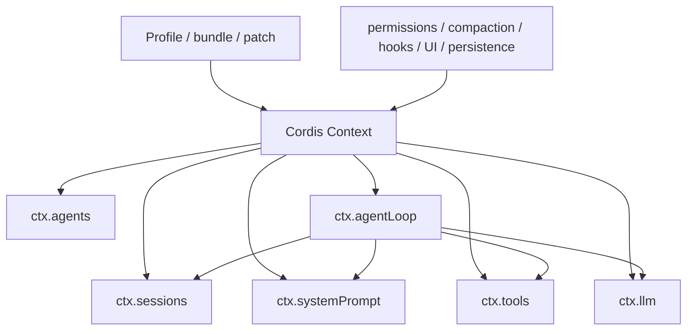

# [DeepSeek Harness](https://github.com/deepseek-ai/deepseek-harness) 架构解析：从 Cordis 到 一切皆插件的 Agent Runtime

DeepSeek Harness（DSH）首先是一个基于 Cordis 的 Agent 运行时。它的目标不是像 [pi](https://github.com/earendil-works/pi) 一样提供一个固定 Agent 核心，再允许用户在外围增加功能；它把组成 Agent 的能力（llm、session、tools、system-prompt等）拆开，通过插件配置把它们组装成一个具体产品。

要理解 DSH，先理解 Cordis。

## [Cordis](https://github.com/cordiverse/cordis)：服务、事件、依赖和生命周期

Cordis 给插件一个 `ctx`，插件通过它与其它插件协作。`ctx` 主要提供四类能力：

```
ctx.<service>    获取或提供服务
ctx.on(...)      监听事件
ctx.emit(...)    发出通知事件
ctx.effect(...)  注册可在卸载时撤销的副作用
```

例如，工具插件可以在 `ctx.tools` 注册工具；Agent loop 可以从 `ctx.sessions` 读取会话、从 `ctx.llm` 发模型请求；持久化插件可以监听 `session/event` 后将记录写到本地。

```ts
function plugin(ctx) {
  ctx.effect(() => ctx.tools.register(tool))

  ctx.on("tools/pre-execute", async (call, next) => {
    // 执行权限或策略检查
    return next()
  })
}
```

Cordis 处理的是运行时协作，而非业务功能本身：

- 插件用 `inject` 声明需要哪些服务，比如 Agent loop 依赖：

  ```
  ctx.agents
  ctx.sessions
  ctx.llm
  ctx.tools
  ctx.systemPrompt
  ```

- 依赖服务存在后，插件才能激活；

- 服务以 `ctx.<key>` 的形式提供给其它插件；

- 事件由插件发出，Cordis 将它们分发给监听器；

- 通过 `ctx.effect()` 和 `ctx.on()` 注册的内容在插件卸载时自动撤销。

因此，Cordis 不会自动触发 `agent/request` 或 `tools/pre-execute`。这些事件由 Agent loop、工具运行时、session service 等拥有相应事实的插件在正确时机发出。Cordis 只负责把它们以确定的规则交给监听器。

### 服务与事件是两套协作机制

服务用于直接调用能力，事件用于观察或干预运行过程。

```
服务：
  “我需要执行一个工具”
  → ctx.tools.execute(...)

事件：
  “某个工具即将执行”
  → tools/pre-execute
  → 权限、审批、审计插件可以介入
```

服务接口一般由三类角色构成：

```
Service Definition  定义服务接口，例如 ctx.tools
Service Provider    提供具体实现，例如本地工具执行器
Consumer            调用该服务，例如面向模型的 Bash 工具
```

DSH 将这组关系称为 **capability seam**。替换 provider 时，消费者通常不必改变。

事件也有明确模式：

| 模式        | 用途                                 |
| ----------- | ------------------------------------ |
| `emit`      | 仅通知，不等待监听器                 |
| `parallel`  | 并行等待所有监听器                   |
| `serial`    | 按注册顺序等待                       |
| `waterfall` | 中间件链；监听器调用 `next()` 才继续 |

`waterfall` 用于有控制权的阶段，例如 `agent/pre-step`、`agent/request` 和 `tools/pre-execute`。策略插件可以改写请求再继续，也可以不调用 `next()`，直接拒绝或接管操作。[Cordis Primer](https://github.com/deepseek-ai/deepseek-harness/blob/master/docs/cordis-primer.md)

## DSH：将 Agent Runtime 插件化

先解释一下 DSH 中 profile、bundle、plugin 这几个概念：

```
Profile  → 选择 bundle

Bundle  → 声明一组 plugin rows

Plugin row  → 指向一个可执行插件包

Plugin  → 运行后提供服务、注册能力或监听事件
```

1、当前 DSH **内置两套 profile 模板**：

```
web profile
  → 基础 Agent 能力
  → Web 服务和网页 UI
  → Web API、会话列表、浏览器交互

headless profile
  → 基础 Agent 能力
  → 一次性命令行任务运行器
  → 不启动 Web 服务
```

```
web profile
  → dsh-base bundle
      → session plugin
      → agent plugin
      → llm plugin
      → tools / sandbox / persistence plugins
  → dsh-web-app bundle
      → web server / Web UI / API plugins
```

启动时可以指定：

```bash
dsh --profile web # 用“带 Web UI 的运行方案”启动 Agent
dsh --profile headless "修复这个项目的测试" # 用“只执行一次命令行任务的运行方案”启动 Agent
```

2、当前 DSH 有 3 个 bundle：

```bash
packages/bundle/
├─ base/
├─ web-app/
└─ headless/
```

| Bundle          | 包                          | 作用                                                         |
| --------------- | --------------------------- | ------------------------------------------------------------ |
| 基础 bundle     | `@deepseek-ai/dsh-base`     | 所有 profile 的共同底座：session、Agent、LLM、工具、持久化、sandbox、权限等。[基础配置](https://github.com/deepseek-ai/deepseek-harness/blob/master/packages/bundle/base/cordis.patch.yml) 描述了默认产品的实际构成。 |
| Web bundle      | `@deepseek-ai/dsh-web-app`  | Web UI、Web API 和浏览器交互相关能力。                       |
| Headless bundle | `@deepseek-ai/dsh-headless` | 一次性 CLI 任务运行器，不启动 Web 服务。                     |

bundle 的 `cordis.patch.yml` 列出要插入哪些插件：

```bash
- id: session
  name: '@deepseek-ai/dsh-session'

- id: agent
  name: '@deepseek-ai/dsh-agent'

- id: tool-bash
  name: '@deepseek-ai/dsh-tool-bash'
```

3、DSH 将 Agent 运行时拆分成以下核心能力，也就是各个插件：

```bash
@deepseek-ai/dsh-session
@deepseek-ai/dsh-system-prompt
@deepseek-ai/dsh-agent
@deepseek-ai/dsh-agent-loop
@deepseek-ai/dsh-tools
@deepseek-ai/dsh-llm
@deepseek-ai/dsh-session-persistence-jsonl
```

上面的 yml 只是 Cordis 的“加载声明”，具体各个插件是如何成为 ctx 中的服务，可以看下面的例子：

**`dsh-session`：提供 `ctx.sessions`**

它导出的 `SessionStore` 继承 Cordis `Service`：

```ts
export class SessionStore extends Service {
  constructor(ctx: Context) {
    super(ctx, "sessions")
  }
}
```

这里的 `super(ctx, "sessions")` 告诉 Cordis：把这个 service 实例以 `sessions` 这个 key 提供到当前 context。

因此其它插件可以拿到同一个实例：

```ts
ctx.sessions.create(...)
ctx.sessions.get(...)
ctx.sessions.fork(...)
```

4、还有一个概念是 preset，它们决定的是“这个 session 的 Agent 能看到什么 prompt、工具和 agent 级插件”

```ts
apps/cli/config/agent-presets/
├─ standard/   完整编码 Agent
├─ code/       PTC / Code Mode Agent
├─ minimal/    两工具极简 Agent
└─ cordis/     可检查与创作 Cordis preset 的高权限 Agent
```

```ts
一个 DSH 进程
  选择一个 profile
    可创建多个 session
      每个 session 选择一个 Agent preset
```

### 包、插件和 `ctx` 服务的关系

这三个名词属于不同层级，不能互换使用。

```text
包（package）
→ 磁盘上的一个 npm/workspace 单元，例如 packages/core/session/

插件（plugin）
→ 该包导出的、能由 Cordis Loader 挂载的运行时代码

服务（service）
→ 已挂载插件放到 ctx.<key> 上、供其它插件直接调用的实例
```

`@deepseek-ai/dsh-session` 是包名；该包导出的 `SessionStore` 是 Cordis 服务实现；运行后其它插件取得的是 `ctx.sessions`。配置文件中的一行只是加载声明：

```yaml
- id: session                         # 配置行身份，patch 通过它覆盖配置
  name: '@deepseek-ai/dsh-session'    # 要 import 的包
```

Loader 的过程是：import 这个包，挂载其导出的插件，再由插件决定是否创建服务、注册工具或监听事件。

```
配置行
  - name: '@deepseek-ai/dsh-session'
      ↓
npm 包被加载
      ↓
该包导出的 Cordis 插件被挂载
      ↓
插件可能做零个或多个动作：
  1. 提供 ctx.<key> 服务
  2. 消费已有 ctx.<key> 服务
  3. 注册工具、prompt、adapter
  4. 发出事件
  5. 监听事件
```

`dsh-session` 的插件创建 `SessionStore`，并用 `super(ctx, 'sessions')` 将实例提供为 `ctx.sessions`。它维护内存 event log 和 live session；`dsh-session-persistence-jsonl` 则是另一个包、另一个插件。后者消费 `ctx.sessions` 的 `session/event`，同时提供它自己的 `ctx.sessionPersistence`，将日志写入 JSONL。它不是 `ctx.sessions` 的 provider。

`dsh-agent` 同样提供 `ctx.agents`，但它只持有 Agent registry 和 `AgentFactory` 入口，并不自己实现默认 loop。`dsh-agent-loop` 是另一个插件：它消费 `ctx.agents`、`ctx.sessions`、`ctx.llm`、`ctx.tools`、`ctx.systemPrompt`，提供 `ctx.agentLoop`，并通过 `ctx.agents.setFactory(...)` 登记默认的 Agent 创建和运行实现。调用方一般只调用 `ctx.agents.create()` 或 `resume()`，不直接依赖 `ctx.agentLoop`。

`dsh-tools` 提供 `ctx.tools`。`dsh-tool-bash` 不是一个 `ctx.bash` 服务：它消费已有的 `ctx.tools`、`ctx.shell`、`ctx.systemPrompt` 和 `ctx.shellEnv`，再向 `ctx.tools` 注册模型可调用的 `bash` 工具。`dsh-tool-fs`、`dsh-tool-web`、`dsh-tool-subagent` 也是同一种模式：消费所属能力服务，再将一个模型工具注册到工具表。

其它能力遵循相同分工：`dsh-llm` 提供 `ctx.llm`，而 DeepSeek、Pi AI 等 adapter 向它注册模型路由；`dsh-shell` 提供 `ctx.shell`，本地 Bash、sandbox Bash、PowerShell 是它的执行实现；`dsh-fs` 提供 `ctx.fs`，本地、E2B 和 sandbox 后端实现实际文件操作。

因此，一个插件可以只做其中一项，也可以同时做多项：提供 `ctx` 服务、消费其它服务、注册工具或 prompt、发出事件、监听事件。工具插件通常不提供新的 `ctx.<key>`；持久化、策略和 UI 插件也常常只是消费服务和事件。

### 一个实际产品通过 profile、bundle 和 YAML patch 叠加插件行

Patch 层：通常 5 层

```
base bundle
  # 所有 profile 的基础插件集合。
  # 通常包含 session、Agent、LLM、工具、持久化、权限、沙箱等默认能力。

→ profile bundle
  # 当前运行模式附加的插件集合。
  # 例如 web profile 增加 Web 应用，headless profile 增加一次性命令行运行器。

→ profile patch
  # 此 profile 自己的 cordis.patch.yml。
  # 可替换某个已有插件行的完整配置，或插入新的插件行。

→ user patch
  # Harness home 下用户级 cordis.patch.yml。
  # 对该用户所有运行使用的最终本地定制，例如替换模型、调整权限或增加个人插件。

→ CLI patch
  # 本次命令通过 --patch 传入的临时覆盖。
  # 优先级最高，只影响这一次启动，不修改 profile 或用户配置。
```

Harness home 是用户的 DSH 配置目录。其概念结构是：

```
$DSH_HOME/
├─ cordis.patch.yml              # user patch
├─ settings.yaml
├─ .credentials.yaml
├─ sessions/
└─ profiles/
   └─ web/
      ├─ package.json            # 声明 profile bundles
      └─ cordis.patch.yml        # profile 自己的 profile patch
```

patch 的覆盖规则是“按插件行的 `id` 定位，替换整行 `config`”，不是深度合并：

```
# 原配置
- id: tool-bash
  config:
    timeoutMs: 60000
    cwd: /workspace

# patch 后：必须重写仍需保留的字段
- id: tool-bash
  config:
    timeoutMs: 120000
    cwd: /workspace
```

### 完整主链路：启动、创建 Agent 与执行 turn

DSH 的产品入口统一是 `apps/cli` 的 `dsh` 命令。CLI 先选择 profile，再将 profile 所需的 bundle 和 patch 合成为一棵 Cordis 插件树；只有等服务依赖满足后，各插件才激活。



```text
dsh --profile <web | headless>
→ 读取 profile 的 bundle 列表
→ 合成 base / profile bundle / profile patch / user patch / CLI patch
→ Cordis Loader 挂载插件树
→ 建立 host 级共享服务
   ctx.sessions、ctx.systemPrompt、ctx.tools、ctx.llm、ctx.agents、ctx.agentLoop
   + sandbox、shell、filesystem、persistence、settings、credentials 等
→ 当前 profile 的入口插件开始工作
```

两个内置 profile 在这一步之后分叉：

```text
web profile
→ 启动 Web server、API gateway 与浏览器 UI
→ 用户在 UI 新建或恢复 session
→ 选择 Agent preset（standard / code / minimal / cordis）
→ preset 通过 agent scope 加入该 Agent 的工具、prompt 与监听器
→ ctx.agents.create() / resume()
→ 已登记的 ctx.agentLoop factory 创建具体 Agent 和 session

headless profile
→ CLI 接收一个任务文本
→ 直接创建一次性 Agent
→ 当前 shipped composition 不挂 agent-preset roster
→ Agent 完成、输出结果并退出
```

创建完成后，默认 loop 的每个 turn 使用核心 spine：

```text
followup / steer 唤醒 Agent
→ ctx.sessions 记录 turn/start，并从 inbox 领取输入
→ agent/pre-step：插件可改写或拒绝该 step 的输入
→ ctx.systemPrompt 组装当前 scope 可见的 prompt section 与工具 schema
→ ctx.sessions 从 event log 投影模型历史
→ ctx.llm 选择 adapter 并流式请求模型
→ ctx.sessions 追加 assistant/chunk*、assistant/message
→ ctx.tools 按 scope 解析工具，执行 pre / execute / post 管线
→ ctx.sessions 追加 tool/call、tool/result、step/end
→ 有待处理输入或工具结果则进入下一 step；否则 turn/end
```

持久化、UI、遥测等不直接介入模型循环：它们监听 `session/event`。这让 Agent loop 只负责驱动工作，而会话落盘、渲染和观测都从同一条 event log 获取事实。

## 默认 Agent loop：一个 turn 包含多个 step

DSH 把一次模型请求称为 step，把一次完整工作过程称为 turn。

```
step = 一次模型请求 + 这次请求产生的工具调用
turn = 零个或多个 step
```

默认 loop 的流程如下：

```
收到 followup / steer
→ turn/start
→ 从 inbox 领取输入
→ agent/pre-step
→ step/start
→ 写入 user/message
→ 组装 prompt 与工具 schema
→ 从 session log 派生模型历史
→ agent/request → llm/stream
→ 写入 assistant/chunk* 与 assistant/message
→ 执行工具调用
→ 写入 tool/call 与 tool/result
→ step/end
→ 如仍有工作，开始下一 step
→ agent/turn-stopping
→ turn/end
```

`followup`、`steer` 和 `inject` 的区别也被编码进 loop：

| API          | 放入何处  | 是否唤醒 |
| ------------ | --------- | -------- |
| `followup()` | 下一 turn | 是       |
| `steer()`    | 下一 step | 是       |
| `inject()`   | 下一 step | 否       |

这使普通追问、运行中纠偏和外部上下文注入具有不同调度语义。

## Session：日志是事实源，messages 是派生视图

DSH 在内存中当然维护 session 数据，但权威对象不是一个可任意修改的 `messages[]`。

live session 的主要内存状态是：

```
session.header
session.events[]
surface projection
```

模型请求由 session event log 推导出最终的请求上下文：

```
session.events[]
→ surface projection
→ deriveMessages()
→ 加上 prompt sections 与工具 schema
→ LLM request
```

事件比模型消息更详细：

| 事件                | 作用                               |
| ------------------- | ---------------------------------- |
| `user/message`      | 用户输入、steer、inject 等模型输入 |
| `assistant/chunk`   | 流式输出和 UI 回放                 |
| `assistant/message` | 一次模型调用的最终结果             |
| `tool/call`         | 模型发出的工具调用                 |
| `tool/result`       | 工具返回给模型的结果               |
| `turn/*`、`step/*`  | 生命周期、取消与恢复边界           |

模型并不会看到所有事件。比如 `assistant/chunk` 主要用于流式 UI 和回放；模型历史通常取最终的 `assistant/message`。

因此 DSH 的规则是：

> 任何进入模型请求的信息，都必须能够由 session event log 重建。

这使恢复、fork、审计、回放、UI 和模型上下文共用同一份事实来源。

### 内存日志与 JSONL 的关系

DSH 的内存 event log 和本地 JSONL 在语义上对应同一条记录流，但运行中通常是最终一致，而不是逐事件同步写盘。

```
内存提交 event
→ 发出 session/event
→ persistence 插件接收
→ write-behind 缓冲
→ 追加到 JSONL
```

所以一个短暂窗口内，内存可能比磁盘多几条已提交事件。需要确认落盘时调用 `session.flush()`，它会等待持久化插件完成写入。

```
内存 events：100
磁盘 JSONL：98
等待 flush 后：
磁盘 JSONL：100
```

恢复时，持久化后端读取 JSONL、校验事件序列、处理不完整尾部，再建立新的 live session。内存 event log 是运行中的即时状态，JSONL 是可恢复的持久化表示。[session](https://github.com/deepseek-ai/deepseek-harness/blob/master/packages/core/session/src/index.ts) 与 [persistence coordinator](https://github.com/deepseek-ai/deepseek-harness/blob/master/packages/core/session/src/index.ts) 共同实现这项机制。

## Scope：让插件只影响某些 Agent

Scope 控制工具、prompt 和事件监听器对哪些 Agent 生效。

实现：

1. 每个 scope 有一个不透明对象 `ScopeKey`。

2. 创建 Agent 时，loop 为该 Agent 创建一个 agent-scoped Cordis context。

   `agent.ctx` 和启动时的全局 `ctx` 不是同一个 Context 对象，但它是从全局/宿主 Context 派生出来的子 Context。

   ```
   root ctx（host context）
     ├─ ctx.sessions
     ├─ ctx.llm
     ├─ ctx.tools
     ├─ ctx.agents
     ├─ ctx.agentLoop
     ├─ sandbox / persistence / shell ...
     │
     ├─ Agent A 的 agent.ctx
     │    └─ scope key: A
     │    └─ 注册 Agent A 专属工具、prompt、监听器
     │
     └─ Agent B 的 agent.ctx
          └─ scope key: B
          └─ 注册 Agent B 专属工具、prompt、监听器
   ```

   `agent.ctx` 会继承宿主服务，因此 Agent A 仍可使用：

   ```
   agent.ctx.sessions
   agent.ctx.llm
   agent.ctx.tools
   agent.ctx.agents
   ```

   这些通常仍指向 host 层的共享服务实例。

   不同之处在于：`agent.ctx` 带有该 Agent 的 scope tag。通过它注册的内容会被标记为“仅对这个 Agent 或其子 scope 有效”。

3. preset scope、agent scope 通过父子关系连接。

4. 注册工具、prompt、事件监听器时，注册发生在哪个 scoped context，就带上哪个 scope tag。

5. 查找与事件分发时，根据当前 Agent 的 scope chain 过滤。

它的层级通常是：

```
agent scope
→ preset scope
→ global scope
```

Agent 查询注册时按这个顺序寻找：

```
当前 agent 的注册
→ 所属 preset 的注册
→ 全局注册
```

因此：

- 一个 Agent 可以有只属于自己的工具或 prompt；
- 同一 preset 的多个 Agent 可以共享同一套工具和提示词；
- Agent 本地注册可以覆盖 preset 或全局同名注册；
- 一个 preset 的监听器不会收到另一个 preset 中 Agent 的事件。

事件分发时，当前 Agent 的事件会交给：

```
全局监听器
当前 agent scope 的监听器
当前 preset scope 的监听器
```

不会交给兄弟 Agent 或其它 preset 的监听器。

Scope 不改变 `ctx.tools`、`ctx.llm` 这类服务接口。它改变的是“当前 Agent 查找哪些注册”以及“哪些监听器有资格收到当前事件”。[scope 实现](https://github.com/deepseek-ai/deepseek-harness/tree/main/packages/core/scope)

## 与 Pi 的架构对比

Pi 也有 extension、工具、事件和 session，但其结构更接近“一个固定 Agent runtime 加可编程扩展”。

| 维度       | DSH                                        | Pi                                    |
| ---------- | ------------------------------------------ | ------------------------------------- |
| 核心形态   | 可组合的 Agent runtime                     | 固定 coding-agent runtime             |
| Agent loop | 默认 provider，可替换                      | runtime 的核心控制流                  |
| 扩展方式   | 服务、provider、scope、typed events、patch | ExtensionAPI、工具、命令、事件、UI    |
| 依赖关系   | `inject` 声明服务依赖                      | extension 获得统一 API 与 context     |
| 多 Agent   | 原生 scope 组合和隔离                      | 主要围绕当前 session runtime          |
| 会话事实源 | append-only event log                      | JSONL tree 与当前 branch entries      |
| 模型历史   | 从 event log 投影                          | 从当前 branch messages / entries 构造 |
| 持久化     | 独立 persistence provider 订阅日志         | session 写入与 extension 状态恢复     |
| 默认取向   | 可替换能力的组合                           | 轻量核心，更多能力由 extension 提供   |

Pi extension 的典型形式：

```ts
export default function (pi) {
  pi.registerTool(...)
  pi.registerCommand(...)
  pi.on("tool_call", ...)
}
```

它可以监听 Agent 生命周期、修改请求、阻断工具、定制 compaction、提供 UI。Pi 的官方扩展点包括 `before_agent_start`、`context`、`before_provider_request`、`tool_call`、`tool_result`、`agent_settled` 和 `session_shutdown`。[Pi extensions](https://github.com/earendil-works/pi/blob/main/packages/coding-agent/docs/extensions.md)

DSH 的插件除了能做这些，也可以替换模型 provider、持久化后端、sandbox provider、Agent factory，甚至默认 loop。

因此可以压缩为一句：

> Pi 的插件主要是在既有 Agent 生命周期中加入行为；DSH 的插件既能加入行为，也能组成、隔离和替换 Agent runtime 的核心能力。

## 项目结构分析

这个仓库是 pnpm monorepo。`packages/` 承载可发布的 `@deepseek-ai/dsh-*` 包；`apps/` 是实际产品入口；其它顶层目录分别承载文档、示例、脚本、跨语言 SDK 和本地安全运行器。

### 顶层目录

| 目录 | 作用 |
| --- | --- |
| `apps/` | 可直接启动的产品：`cli/` 是 `dsh` 命令与 profile 启动逻辑，`web/` 是浏览器 UI、Web API 和页面端插件。 |
| `packages/` | DSH 的主要实现。每个 `packages/<group>/<package>` 通常是一个 workspace 包。 |
| `docs/` | 架构、子系统参考、开发规范、用户文档、教程与生成的目录。阅读代码前优先看 `architecture.md`。 |
| `examples/` | 可运行的最小 Cordis composition，例如 headless、ACP、JSON-RPC、MCP memory 和 Web 示例；用于验证真实装配。 |
| `python/` | Python SDK 及其打包运行时。 |
| `native/` | 原生安全组件；`landlock-run/` 是 Linux Landlock 进程约束的源码。 |
| `vendor/` | 固定版本的 Cordis 源码副本；通过仓库规定的同步流程更新，不作为普通 DSH 包修改。 |
| `scripts/` | 构建、生成、文档校验、发布和仓库质量门禁脚本。 |
| `website/` | VitePress 文档站点，投影 `docs/` 中对外发布的内容。 |
| `assets/` | 应用或文档使用的静态资源。 |
| `patches/` | 对第三方依赖或发行包施加的补丁。 |
| `.agents/` | Agent 工作流、skills 与 Agent Notes；不是产品运行时代码。 |
| `.claude/` | Claude Code 相关本地配置。 |

`node_modules/`、各 app 的 `lib/`/`dist/` 都是依赖或构建产物，不是应直接维护的架构源码。

### `apps/`：产品入口

```text
apps/
├─ cli/   dsh 命令、profile 初始化、patch 合成、headless 启动
└─ web/   Web 服务、浏览器页面、会话与 Agent 的远程交互
```

`apps/cli/config/agent-presets/` 随 Web 产品交付四个 agent preset：`standard`、`code`（PTC）、`minimal` 与 `cordis`（创造模式）。它们不是 profile；profile 决定整个进程的运行形态，preset 决定一个 session 中 Agent 的 prompt、工具与 agent 级插件组合。

### `packages/`：能力组与包的组织方式

一个 group 将相近的插件放在一起。常见模式是：一个抽象服务定义包、一个或多个 provider 包，以及一个面向模型的 tool consumer 包。

| group | 主要包和职责 |
| --- | --- |
| `core/` | 产品主干：session、system prompt、tools、Agent registry、scope 与默认 loop。 |
| `llm/` | `llm` 定义模型调用服务；`llm-deepseek`、`llm-pi-ai` 是 adapter；`llm-retry` 处理重试；`token-meter` 统计上下文。 |
| `session/` | session 持久化、JSONL/SQLite 后端、日志投影、标题、统计、遥测与 checkpoint。 |
| `shell/`、`subprocess/`、`terminal/` | 一次性 shell 命令、底层子进程与持久 PTY terminal 能力。 |
| `fs/`、`lsp/` | 文件系统与语言服务器能力，以及面向模型的读写、检索、编辑、LSP 工具。 |
| `sandbox/`、`e2b/` | 本地或远端执行环境的约束与 provider；sandbox 负责文件/进程访问策略。 |
| `skill/`、`context/` | Agent Skills 的发现和加载；工作区指令、时间等模型可见上下文。 |
| `subagent/`、`jobs/`、`workflow/` | 子代理、后台任务与 worker-thread workflow；对应模型调用工具。 |
| `plan/`、`goal/`、`todo/`、`schedule/` | 计划审阅、同 session 目标、待办和定时后续任务。 |
| `web/` | web search/fetch 服务、多个搜索 provider 和模型工具。 |
| `interaction/`、`feedback/` | 用户审批、提问、命令、权限预设和消息反馈。 |
| `preset/`、`bundle/`、`boot/` | per-agent preset 组合、profile bundle patch 和应用启动装配。 |
| `api/`、`sdk/`、`acp/`、`typert/` | Web BFF/API、JSON-RPC SDK、Agent Client Protocol，以及类型图和远程服务注册。 |
| `client/`、`host/` | Web GUI 两端：浏览器 UI 插件与服务端路由/API proxy。 |
| `attachment/`、`storage/`、`workspace/`、`session-query/` | 附件、非 session 存储、工作区实体、session 检索与全文查询。 |
| `settings/`、`credentials/`、`identity/` | 用户设置、凭据引用和匿名用户身份。 |
| `hooks/`、`extensions/`、`guard/`、`runtime-diagnostics/` | Claude/Codex hook bridge、运行时自修改、loop 卫生策略和不变量诊断。 |
| `code-runtime/`、`spill/` | Code Mode 的 TypeScript 执行环境；超大工具结果的外溢存储和策略。 |
| `mcp/` | MCP client 能力。 |
| `test-support/`、`examples/`、`util/` | 测试工具、演示 bundle 和无依赖底层工具函数。 |
